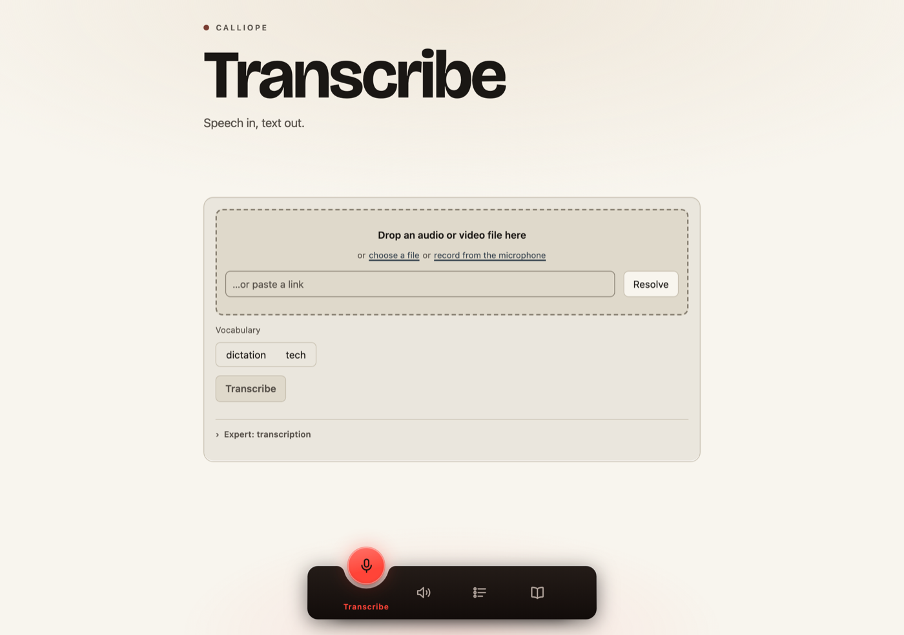
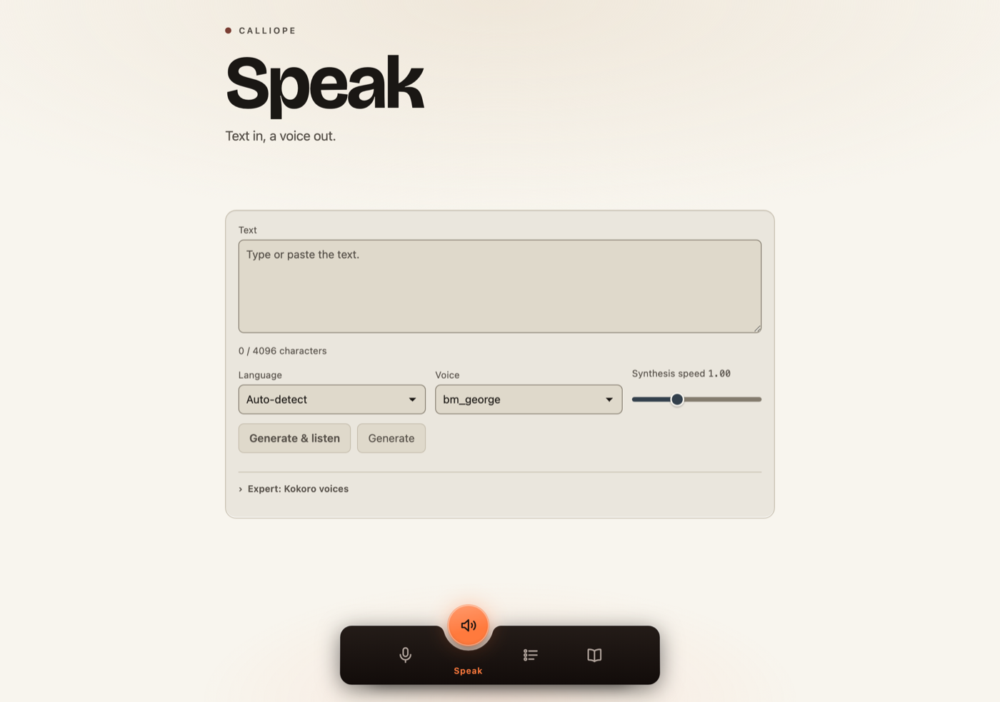
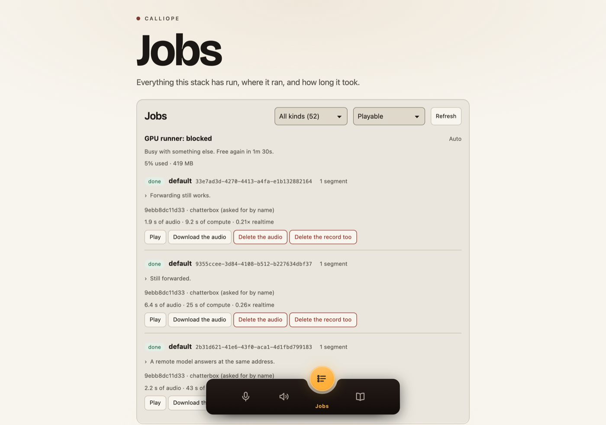
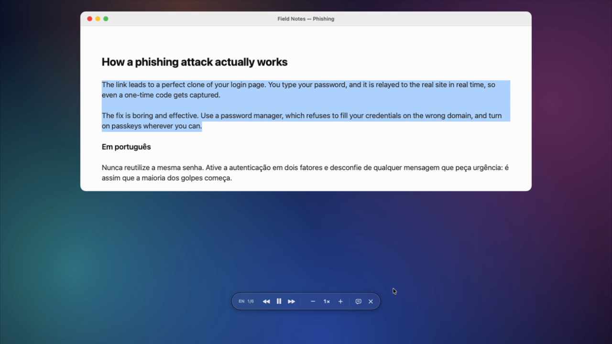
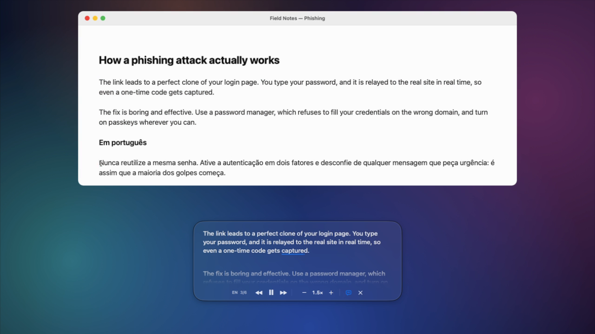
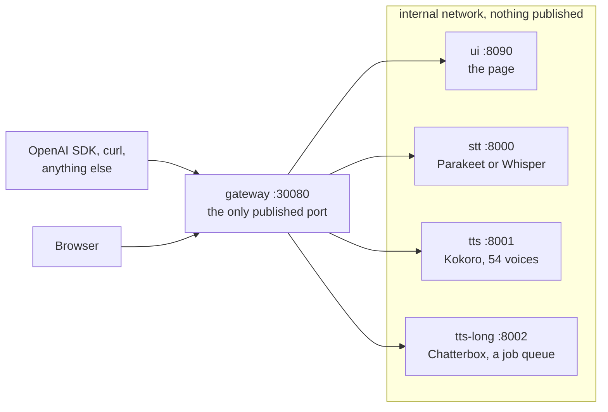
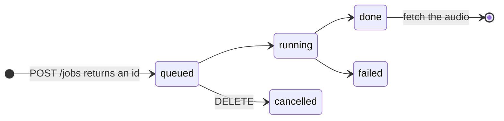

# Calliope


[](docs/adr/0001-openai-api-compatibility.md)


**Speech in, text out. Text in, a voice out.**

A self-hosted speech stack: transcription, speech, long documents as jobs, and
voice cloning from a reference clip. Six containers behind one
OpenAI-compatible port, with a web page at the same address and a macOS app
that reads any selection aloud. Every image runs on CPU — no CUDA, nothing
to install on the host.



```bash
git clone https://github.com/gabrielbelli/calliope
cd calliope
$EDITOR compose.yaml      # five things belong to another machine — see Run it
docker compose up -d
```

All six images are published to `ghcr.io`, so nothing has to be built.
`compose.yaml` is a live deployment rather than a template, so it will not come
up unedited; [Run it](#run-it) names every line.

One port is published, **30080**, and it is both the API and the page: `/`
redirects to `/ui`, `/v1/…` is the API, and the other four services stay on the
internal network.

## The page

Four tabs, one HTML file, no build step.

**Speak** — type, choose one of 54 voices, listen. Kokoro answers immediately
and returns `mp3`, `opus`, `aac`, `flac`, `wav` or headerless `pcm`.



**Jobs** — everything the stack has run, where it ran and how long it took,
playable and downloadable from the row.



**Transcribe** takes a dropped file, the microphone, or a pasted link.
**Vocabulary** edits the profiles that bias the recogniser; `dictation` and
`tech` ship built in.

## On your Mac

```bash
brew install --cask gabrielbelli/tap/calliope
```

Select text in any application and press **⌥⌘S**. A capsule appears and reads
it aloud.



It can grow upward into a reader that runs an underline across each word as it
is spoken.



The app carries its own Kokoro model, so it speaks with nothing configured and
no network — about 4.9× realtime on an M2 Max's CPU. It needs macOS 26, and
Accessibility permission to read another application's selection. A Calliope
server is opt-in, from the menu bar: **Settings…** → *Use a Calliope server*.
[`clients/macos-player`](clients/macos-player/README.md) has the rest,
including the optional OpenClip action.

## Around the house

**Satellites** are thin audio devices: a microphone array, a speaker and a ring
of lights on Wi-Fi, making no decisions of their own. A new one opens a Wi-Fi
network to be set up from a phone, connects to
`wss://<host>:30080/satellites/ws` through the same port as everything else,
and waits on the **Satellites** tab to be adopted. From there the stack sets
its volume and lights, plays speech or a tone on it, records from its
microphones, and updates its firmware over the air. An update the satellite
cannot bring back to the hub rolls itself back.

The hub also listens. It cleans each satellite's microphones (echo
cancellation, beamforming, noise suppression), waits for the wake words
assigned to that satellite ("hey jarvis" on every satellite by default; the
Satellites tab adds more and chooses which satellites hear each) or a press
of PLAY, transcribes what follows on `stt-stack`, sends it where a rule says
(Home Assistant, any OpenAI-compatible LLM, a webhook, or straight back as an
echo), and speaks the answer on the satellite the rule names. Home Assistant
can also see every satellite as a device over MQTT. None of the listening has
run on a board yet; it is tested against fakes and a recorded voice, and
`POST /satellites/{id}/inject` runs a clip through it with nobody in earshot.

The first board is Espressif's ESP32-Korvo v1.1 (three microphones, a speaker
loopback for echo cancellation, twelve LEDs, six buttons).
[`services/satellites`](services/satellites/README.md) is the hub and the
protocol; [`clients/korvo-satellite`](clients/korvo-satellite/README.md) is the
firmware.

## The API

Point any OpenAI client at `/v1`.

```python
from openai import OpenAI

client = OpenAI(base_url="http://your-host:30080/v1", api_key="unused")

text = client.audio.transcriptions.create(
    model="parakeet", file=open("meeting.m4a", "rb"))

audio = client.audio.speech.create(
    model="kokoro", voice="bm_george", input="Ready when you are.")
```

| Ask for this `model` | Answered by | You get |
|---|---|---|
| `parakeet`, `whisper-1` | `stt` | a transcript |
| `kokoro`, `tts-1`, `tts-1-hd`, `gpt-4o-mini-tts` | `tts` | audio, straight away |
| `chatterbox`, `chatterbox-turbo`, `tts-long` | `tts-long` | a job id |

Those nine ids are what `GET /v1/models` advertises.

**OpenAI-shaped:** `POST` on `/v1/audio/transcriptions`,
`/v1/audio/translations`, `/v1/audio/speech` and `/v1/chat/completions`; `GET`
on `/v1/models` and `/v1/models/{id}`. No language model runs here — a chat
request carrying audio is transcribed, and one without gets a fixed reply.

**Native:** `POST /transcribe`, `POST /speak`, `GET /voices`; `GET
/glossaries`, and `GET`, `PUT`, `DELETE` on `/glossaries/{name}`; `POST` and
`GET /jobs`, `GET /jobs/{id}`, `GET /jobs/{id}/audio`, `DELETE` on both.

`GET /health` is the only route that never needs a key.

> [!NOTE]
> On the transcription side `model` does not choose an engine. One recogniser
> is loaded per deployment, by `STT_MODEL`. `whisper-1` is accepted so existing
> clients keep working, and every `/v1` response carries `x-stt-engine` naming
> the engine that actually ran.

Deviations from OpenAI's schema, and the measurement forcing each one, are in
[ADR 0001](docs/adr/0001-openai-api-compatibility.md) and in each service's
README.

## What is running



| | Image | Runs | Resident |
|---|---|---|---|
| [`services/stt`](services/stt/README.md) | `calliope-stt` | Parakeet TDT 0.6B v3, or Whisper large-v3 with `STT_MODEL=whisper` | 1.4 GB |
| [`services/tts`](services/tts/README.md) | `calliope-tts` | Kokoro-82M, 54 voices, six output formats | 0.33 GB |
| [`services/tts-long`](services/tts-long/README.md) | `calliope-tts-long` | Chatterbox and Chatterbox Turbo, as jobs | 6.6 GB |
| [`services/gateway`](services/gateway/README.md) | `calliope-gateway` | Auth, routing, one health answer | — |
| [`services/ui`](services/ui/README.md) | `calliope-ui` | The page, and link ingestion through MeTube | — |

On the deployed NAS: Parakeet 8.5–10.4× realtime, Kokoro 1.8× at four threads
and 2.8× at eight, Chatterbox 0.21×. The gateway hop adds 0.85 ms on a laptop over
loopback and has not been measured on the NAS.
**A realtime factor is a property of the machine, not of the model** — `GET
/health` reports your own, with the sample count beside it.

Only `tts-long` carries torch; `stt` and `tts` run on ONNX Runtime and
CTranslate2 instead. As written `compose.yaml` asks for 31 CPUs and about
18.9 GB across the five, which is the box it came from rather than a
requirement.

### Transcription

Parakeet is the default, measured across 25 conditions and five Brazilian
Portuguese corpora on identical audio:

| | pt-BR WER | English WER | Resident | Disk |
|---|---|---|---|---|
| **Parakeet TDT 0.6B v3** | **0.144** | **0.121** | 1.4 GB | 461 MB |
| Whisper large-v3 | 0.250 | 0.131 | 2.9 GB | 2.9 GB |

Parakeet won 21 of the 25, at roughly seventy times the speed, and degrades far
better: band-limiting to 4 kHz, which is what a cheap or distant microphone
does, cost Whisper +206% WER and Parakeet +41%. Whisper leads on clean read
speech and is the only engine here that translates, streams, or takes
`language` — it costs an order of magnitude in latency and a redeploy. Both
bias their decoder from a vocabulary profile.

### Long speech is a job



Chatterbox runs at about 0.21× realtime here, so ten minutes of speech is
roughly three-quarters of an hour of compute and no HTTP request survives the
wait. The queue holds 32; the model loads on first use and unloads after ten
minutes idle. `chatterbox` clones any reference clip in 23 languages;
`chatterbox-turbo` needs five seconds of reference and speaks English only. Two
engines, both jobs — see
[ADR 0008](docs/adr/0008-two-engines-and-both-stay-jobs.md).

> [!IMPORTANT]
> `POST /v1/audio/speech` with a long model may answer **202 with JSON**
> instead of audio: short input is waited on, anything longer comes back as a
> job id. `openai-python` does not raise on a 2xx, so `stream_to_file` will
> write that JSON into your `.wav`. Check `Content-Type`, or use `POST /jobs`
> and mean it.

## Run it

Five things in `compose.yaml` belong to the machine it came from.

| In `compose.yaml` | What it is | What to do |
|---|---|---|
| `GATEWAY_TLS_CERT`, `GATEWAY_TLS_KEY`, the `/etc/certificates` mount | a certificate nobody else has | Point them at your own, or delete all three and serve plain HTTP. TLS is opt-in, and half-configured is a refusal to start rather than a quiet fallback |
| the gateway `healthcheck` and `UI_GATEWAY_URL` | both dial the gateway over `https` | Change both to `http` if you dropped TLS |
| `TTS_RUNNER_*` and the `runner-key` bind mount | an optional GPU box on another LAN | Delete both. `tts-long` runs everything locally without it |
| `UI_METUBE_URL` | a MeTube instance on that LAN | Delete it and the link box is not rendered. MeTube has no authentication of its own, so firewall it if you do configure one |
| `AIV_HOST_LABEL`, `cpus:`, `mem_limit:` | a label stamped into every job record, and the size of the original box | Your own name, and limits that fit your machine |

**First start is slow, legitimately.** No model is baked into any image; each
downloads into its own volume — Parakeet 461 MB, Kokoro about 340 MB — and the
healthcheck `start_period` allows 600 s for `stt` and 900 s for `tts-long`, so
a quarter of an hour before the stack reports healthy is normal. Chatterbox
pulls about 3 GB on the first job rather than at boot. Later starts are
immediate.

> [!WARNING]
> **Setting `GATEWAY_API_KEYS` takes the web page offline.** The check is
> middleware over the whole application and `/health` is its only exemption, so
> a browser navigating to `/` or `/ui` is answered 401 — and the page has no
> box to type a key into. `UI_GATEWAY_API_KEY` signs the page container's own
> calls back to the gateway; it cannot sign the browser's navigation, and
> setting it makes anyone who can open the page authenticated by it. Either run
> keyless on a network you trust, or put a reverse proxy in front that supplies
> the header.

> [!CAUTION]
> **Unset means open, for every service.** `GATEWAY_API_KEYS` ships unset, and
> the gateway is the only process here that checks a token — `stt`, `tts` and
> `tts-long` run with authentication off behind it. It says so at WARNING on
> every start. A degenerate value, empty or only commas, exits at startup
> rather than being treated as off.

`/health` needs no key and says a great deal: every backend's internal URL, the
loaded recogniser and its glossary names, voice and queue counts, per-engine
realtime factors and the GPU runner's state. It always answers 200, even when a
backend is down, so read `status` rather than the status code — and do not
publish 30080 to the internet.

## Build and test

Only needed to change an image. The build context is the **repository root**
for all six, because `packages/common` is a path dependency and must be inside
the context.

```bash
docker build -f services/stt/Containerfile -t calliope-stt .
```

Install from the root for the same reason, and run pytest from inside the
service, because each suite imports its own `app`:

```bash
pip install -r services/stt/requirements.txt './packages/common[conformance]'
cd services/stt && python -m pytest tests -q
```

Getting either half wrong produces an error that reads like something else; the
[architecture notes](docs/architecture.md) explain which.

## Reference

Each service's README is the reference for its own surface: every route, every
deviation from OpenAI's schema and the measurement behind it, the full
configuration table.

| | |
|---|---|
| [`services/stt`](services/stt/README.md) | Transcription, the model comparison, vocabulary profiles |
| [`services/tts`](services/tts/README.md) | Kokoro, the voices, the formats, the SSE stream |
| [`services/tts-long`](services/tts-long/README.md) | The queue, both engines, cloning, the optional GPU runner |
| [`services/gateway`](services/gateway/README.md) | Routing, authentication, `/health` |
| [`services/ui`](services/ui/README.md) | The page and the routes behind it |
| [`services/satellites`](services/satellites/README.md) | The satellite hub, adoption, the device protocol, OTA, wake words, routing, MQTT |
| [`packages/common`](packages/common/README.md) | Auth, the error envelope, `/health`, the entrypoint |
| [`clients/macos-player`](clients/macos-player/README.md) | The capsule, the reader, the OpenClip action |
| [`clients/korvo-satellite`](clients/korvo-satellite/README.md) | Satellite firmware: first flash, Wi-Fi setup, buttons, updates |
| [`docs/architecture.md`](docs/architecture.md) | The measurements behind the shape of all this |
| [`docs/adr/`](docs/adr/) | Decisions, dated, with what each one cost |

## Releases and licence

`main` is the only branch. A release is a `v*` tag cut from it, and the
deployment pins a version rather than a floating tag: `compose.yaml` names
`v0.1.0` on all five images, so `git checkout v0.1.0` gives you the stack that
is running. `v0.1.1` is a macOS client release and changed no service code,
which is why the pin has not moved.

BSD 2-Clause throughout. Each service and `packages/common` keep their own
`LICENSE`; upstream terms are in
[`THIRD-PARTY-NOTICES.md`](THIRD-PARTY-NOTICES.md).
