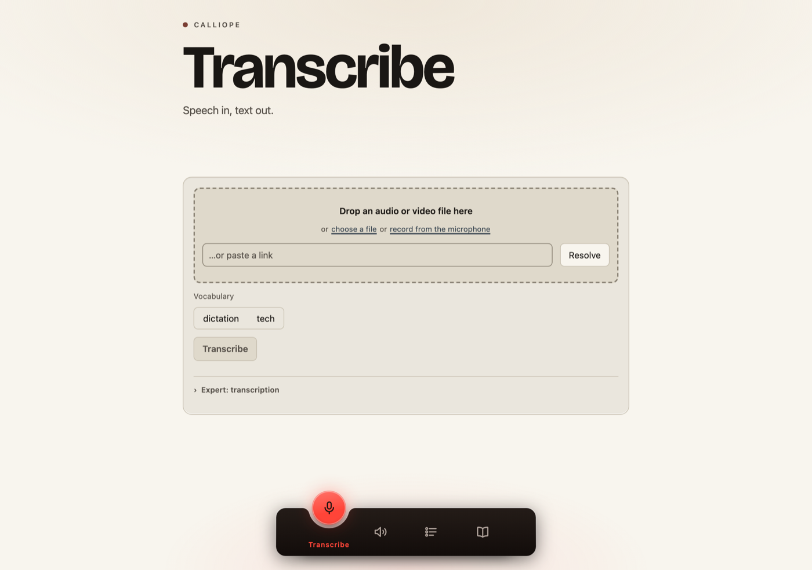
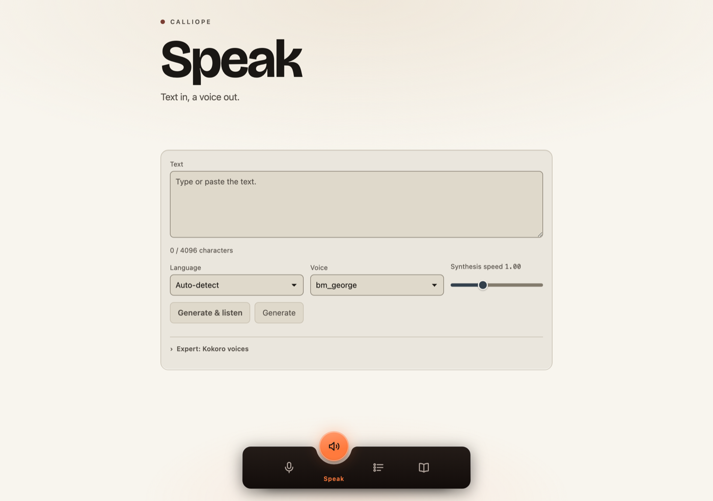
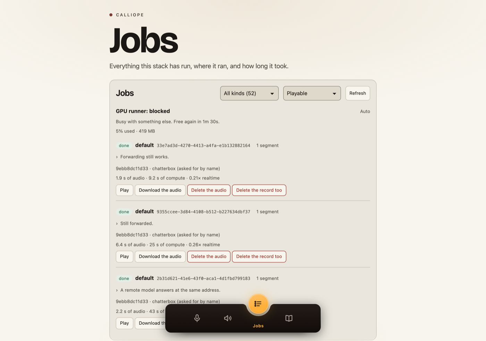
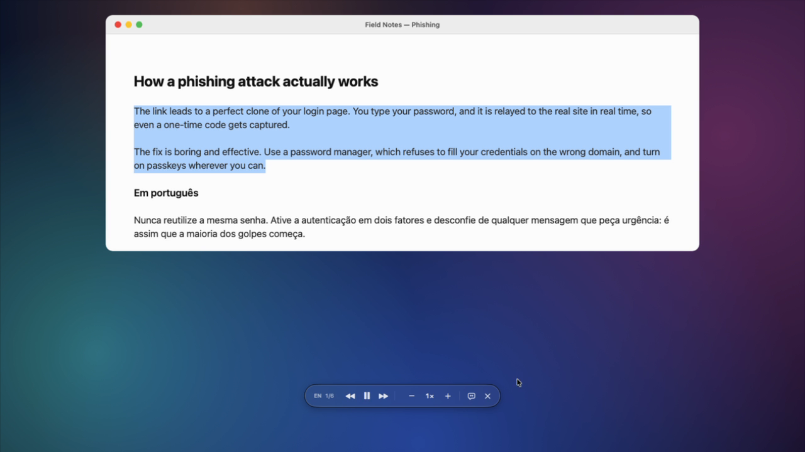
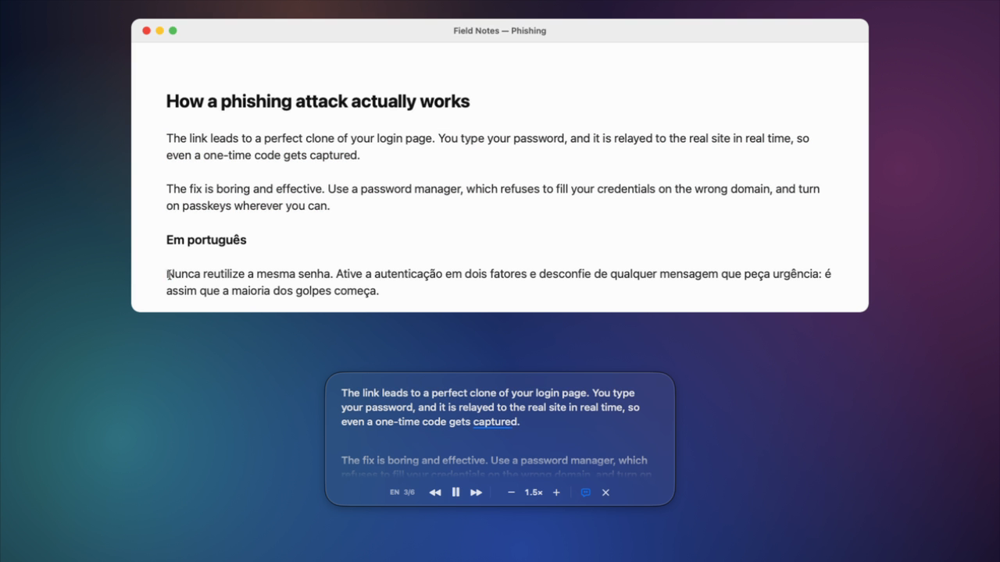
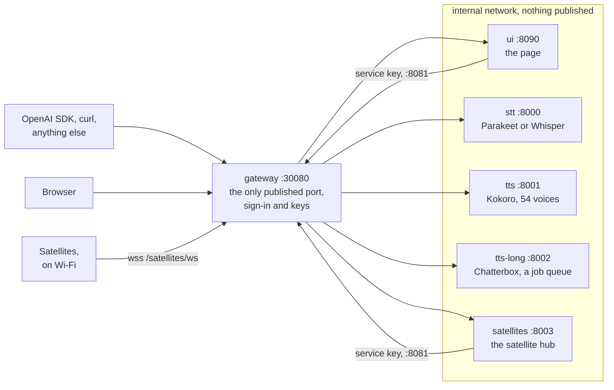
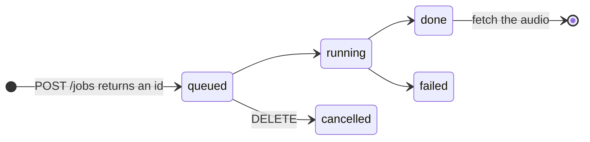

# Calliope


[](docs/adr/0001-openai-api-compatibility.md)


**Speech in, text out. Text in, a voice out.**

A self-hosted speech stack: transcription, speech, long documents as jobs, and
voice cloning from a reference clip. Six containers behind one
OpenAI-compatible port, with a web page at the same address and a macOS app
that reads any selection aloud. Every image runs on CPU, with no CUDA and
nothing to install on the host.



```bash
git clone https://github.com/gabrielbelli/calliope
cd calliope
$EDITOR compose.yaml      # a host name, a first password, and a few more: see Run it
docker compose up -d
```

All six images are published to `ghcr.io`, so nothing has to be built.
`compose.yaml` is a live deployment rather than a template, so it will not come
up unedited; [Run it](#run-it) names every line.

One port is published, **30080**, and it is both the API and the page: `/`
redirects to `/ui`, `/v1/…` is the API, and the other five services stay on the
internal network. **Everything behind it needs a sign-in or an API key**:
people sign in at `/login`, and clients use keys a person creates on the
Account tab. Satellites connect through the same port, with their own
adoption tokens.

## The page

Seven tabs, one HTML file, no build step. A `user-jobs` user sees the first
five below, a `user` the same without Jobs, and an admin all seven.

**Speak.** Type, choose one of 54 voices, listen. Kokoro answers immediately
and returns `mp3`, `opus`, `aac`, `flac`, `wav` or headerless `pcm`.



**Jobs.** Everything the stack has run, where it ran and how long it took,
playable and downloadable from the row.



**Transcribe** takes a dropped file, the microphone, or a pasted link.
**Vocabulary** edits the profiles that bias the recogniser; `dictation` and
`tech` ship built in. Each person's jobs, profiles and cloned voices are
their own. **Account** changes the password, lists the sessions and creates
API keys. **Satellites** adopts satellites and sets up their wake words
([Around the house](#around-the-house)), and **Admin** holds the users, every
key, the secret store and the audit.

## On your Mac

```bash
brew install --cask gabrielbelli/tap/calliope
```

Select text in any application and press **⌥⌘S**. A capsule appears and reads
it aloud.



It can grow upward into a reader that runs an underline across each word as it
is spoken.



The app carries its own Kokoro model, so it speaks with nothing configured and
no network, at about 4.9× realtime on an M2 Max's CPU. It needs macOS 26, and
Accessibility permission to read another application's selection. A Calliope
server is opt-in, from the menu bar: **Settings…** → *Use a Calliope server*.
[`clients/macos-player`](clients/macos-player/README.md) has the rest,
including the optional OpenClip action.

## Around the house

**Satellites** are thin audio devices: a microphone array, a speaker and a ring
of lights on Wi-Fi, making no decisions of their own. A new one opens a Wi-Fi
network to be set up from a phone, connects to
`wss://<host>:30080/satellites/ws` through the same port as everything else,
and waits on the **Satellites** tab to be adopted. From there the stack sets
its volume and lights, plays speech or a tone on it, records from its
microphones, and updates its firmware over the air. An update the satellite
cannot bring back to the hub rolls itself back.

The hub also listens. It cleans each satellite's microphones (echo
cancellation, beamforming, noise suppression) and waits for the wake words
assigned to that satellite, or a press of PLAY. Every satellite hears "hey
jarvis" at first, and the Satellites tab adds words and chooses which
satellites hear each. The hub transcribes what follows on `stt-stack`, sends
it where the wake word's action says (Home Assistant, any OpenAI-compatible
LLM, a webhook, or straight back as an echo), and speaks the answer on the
satellite the action names. A word can also hold a conversation, or be a
trigger that Home Assistant acts on. Home Assistant sees every satellite as a device, through
the Calliope integration
([`clients/home-assistant`](clients/home-assistant/README.md)) or over MQTT.

Listening has run live on the first board: a spoken command was answered by
Home Assistant. Conversations, trigger words and voice barge-in are tested
against fakes so far, and
`POST /satellites/{id}/inject` runs a clip through the hub with nobody in
earshot. The hub's README says
[what has run where](services/satellites/README.md#status).

The first board is Espressif's ESP32-Korvo v1.1 (three microphones, a speaker
loopback for echo cancellation, twelve LEDs, six buttons).
[`services/satellites`](services/satellites/README.md) is the hub and the
protocol; [`clients/korvo-satellite`](clients/korvo-satellite/README.md) is the
firmware.

## The API

Point any OpenAI client at `/v1`.

```python
from openai import OpenAI

client = OpenAI(base_url="https://calliope.example/v1",
                api_key="calliope_…")   # Account › API keys › New key

text = client.audio.transcriptions.create(
    model="parakeet", file=open("meeting.m4a", "rb"))

audio = client.audio.speech.create(
    model="kokoro", voice="bm_george", input="Ready when you are.")
```

| Ask for this `model` | Answered by | You get |
|---|---|---|
| `parakeet`, `whisper-1`, and any engine `STT_MODELS` loads (`parakeet-pt-br`, `whisper`) | `stt` | a transcript |
| `kokoro`, `tts-1`, `tts-1-hd`, `gpt-4o-mini-tts` | `tts` | audio, straight away |
| `chatterbox`, `chatterbox-turbo`, `tts-long` | `tts-long` | a job id |

`GET /v1/models` advertises nine fixed ids. It does not list `parakeet-pt-br`
or `whisper`, which work only where `STT_MODELS` loaded them. `GET /health`
names the engines a deployment loaded.

**OpenAI-shaped:** `POST` on `/v1/audio/transcriptions`,
`/v1/audio/translations`, `/v1/audio/speech` and `/v1/chat/completions`; `GET`
on `/v1/models` and `/v1/models/{id}`. No language model runs here: a chat
request carrying audio is transcribed, and one without gets a fixed reply.

**Native:** `POST /transcribe`, `POST /speak`, `GET /voices`; `GET
/glossaries`, and `GET`, `PUT`, `DELETE` on `/glossaries/{name}`; `POST` and
`GET /jobs`, `GET /jobs/{id}`, `GET /jobs/{id}/audio`, `DELETE` on both.

Every route needs a key with the right scope; a preset such as `user-jobs`,
`transcribe-only` or `speak-only` gives a key exactly what one client needs.
`GET /health` answers without one, with `ok` or `degraded` and nothing more.

> [!NOTE]
> On the transcription side, `model` picks an engine only when it names one
> the deployment loaded with `STT_MODELS`. Any other name, `whisper-1`
> included, gets the default engine, so existing clients keep working. Every
> `/v1` response carries `x-stt-engine` (the family) and `x-stt-model` (the
> engine) that actually ran. [ADR 0016](docs/adr/0016-several-stt-engines.md)
> has the rule.

Deviations from OpenAI's schema, and the measurement forcing each one, are in
[ADR 0001](docs/adr/0001-openai-api-compatibility.md) and in each service's
README.

## What is running


```mermaid
flowchart LR
  C["OpenAI SDK, curl,<br/>anything else"] --> G
  B["Browser"] --> G
  G["gateway :30080<br/>the only published port,<br/>sign-in and keys"]
  subgraph closed ["internal network, nothing published"]
    direction TB
    U["ui :8090<br/>the page"]
    S["stt :8000<br/>Parakeet or Whisper"]
    T["tts :8001<br/>Kokoro, 54 voices"]
    L["tts-long :8002<br/>Chatterbox, a job queue"]
    H["satellites :8003<br/>the satellite hub"]
  end
  D["Satellites,<br/>on Wi-Fi"] -->|"wss /satellites/ws"| G
  G --> U
  G --> S
  G --> T
  G --> L
  G --> H
  H -->|"service key, :8081"| G
  U -->|"service key, :8081"| G
```

Every request is checked at the gateway, which forwards it with a signed
assertion of who is asking; each service verifies that assertion and refuses
anything without one. The services reach each other only through the
gateway's internal listener, `:8081`, which is never published and takes
only their own keys
([ADR 0022](docs/adr/0022-everything-behind-a-login.md)).

| | Image | Runs | Resident |
|---|---|---|---|
| [`services/stt`](services/stt/README.md) | `calliope-stt` | Parakeet TDT 0.6B v3, or Whisper large-v3 with `STT_MODEL=whisper`, or several side by side with `STT_MODELS` | 1.4 GB |
| [`services/tts`](services/tts/README.md) | `calliope-tts` | Kokoro-82M, 54 voices, six output formats | 0.33 GB |
| [`services/tts-long`](services/tts-long/README.md) | `calliope-tts-long` | Chatterbox and Chatterbox Turbo, as jobs | 6.6 GB |
| [`services/gateway`](services/gateway/README.md) | `calliope-gateway` | Sign-in, API keys, routing, the secret store, one health answer | — |
| [`services/ui`](services/ui/README.md) | `calliope-ui` | The page, and link ingestion | — |
| [`services/satellites`](services/satellites/README.md) | `calliope-satellites` | The satellite hub: adoption, wake words, echo cancellation, what each word does. Optional | 228 to 326 MiB, measured with 0 to 6 satellites |

On the deployed NAS: Parakeet 8.5–10.4× realtime, Kokoro 1.8× at four threads
and 2.8× at eight, Chatterbox 0.21×. The gateway hop adds 0.85 ms on a laptop over
loopback and has not been measured on the NAS.
**A realtime factor is a property of the machine, not of the model.** `GET
/health` reports your own, with the sample count beside it.

Only `tts-long` carries torch; `stt` and `tts` run on ONNX Runtime and
CTranslate2 instead. As written `compose.yaml` asks for 32 CPUs and about
19.4 GB across the six, which is the box it came from rather than a
requirement.

### Transcription

Parakeet is the default, measured across 25 conditions and five Brazilian
Portuguese corpora on identical audio:

| | pt-BR WER | English WER | Resident | Disk |
|---|---|---|---|---|
| **Parakeet TDT 0.6B v3** | **0.144** | **0.121** | 1.4 GB | 461 MB |
| Whisper large-v3 | 0.250 | 0.131 | 2.9 GB | 2.9 GB |

Parakeet won 21 of the 25, at roughly seventy times the speed, and degrades far
better: band-limiting to 4 kHz, which is what a cheap or distant microphone
does, cost Whisper +206% WER and Parakeet +41%. Whisper leads on clean read
speech and is the only engine here that translates, streams, or takes
`language`. It costs an order of magnitude in latency, and either a redeploy
or the memory to load it beside Parakeet. Both bias their decoder from a
vocabulary profile. A Brazilian Portuguese fine-tune of Parakeet can be
loaded beside it for Portuguese commands. The
[stt README](services/stt/README.md#which-model) has its measurements.

### Long speech is a job


```mermaid
stateDiagram-v2
  direction LR
  [*] --> queued : POST /jobs returns an id
  queued --> running
  queued --> cancelled : DELETE
  running --> done
  running --> failed
  done --> [*] : fetch the audio
```

Chatterbox runs at about 0.21× realtime here, so ten minutes of speech is
roughly three-quarters of an hour of compute and no HTTP request survives the
wait. The queue holds 32; the model loads on first use and unloads after ten
minutes idle. `chatterbox` clones any reference clip in 23 languages;
`chatterbox-turbo` needs five seconds of reference and speaks English only. Two
engines, both jobs: see
[ADR 0008](docs/adr/0008-two-engines-and-both-stay-jobs.md).

> [!IMPORTANT]
> `POST /v1/audio/speech` with a long model may answer **202 with JSON**
> instead of audio: short input is waited on, anything longer comes back as a
> job id. `openai-python` does not raise on a 2xx, so `stream_to_file` will
> write that JSON into your `.wav`. Check `Content-Type`, or use `POST /jobs`
> and mean it.

## Run it

These lines in `compose.yaml` belong to the machine it came from, are yours to
choose, or are optional.

| In `compose.yaml` | What it is | What to do |
|---|---|---|
| `CALLIOPE_PUBLIC_ORIGIN` | the address people type, `https://<host name>` | **Required.** A host name that serves Calliope and nothing else, on any port: a browser keeps one set of cookies per host name. Unset, the gateway starts locked and says so |
| `CALLIOPE_ADMIN_PASSWORD` | the first admin's first password | Set it for the first start only, in the app's secret settings: at least 15 characters. Sign in as `admin` with it, choose your own, then remove it |
| `CALLIOPE_MASTER_KEY_FILE` and its mount | the key the secret store is encrypted with | Optional. A host file is better than the key the gateway otherwise generates on its own volume; either way, back it up apart from the database ([gateway: Backups](services/gateway/README.md#backups)) |
| `GATEWAY_TLS_CERT`, `GATEWAY_TLS_KEY`, the `/etc/certificates` mount | a certificate nobody else has | Point them at your own. Delete all three only if a reverse proxy in front terminates TLS: the public origin is `https://` either way, and satellites on release firmware connect only to `wss://`. Half-configured is a refusal to start rather than a quiet fallback |
| `CALLIOPE_TRUSTED_PROXIES`, `CALLIOPE_PROXY_PROTOCOL` | a reverse proxy in front | Its address, so sign-in limits and the audit see real client addresses. Never the Docker bridge's subnet ([gateway: Behind a reverse proxy](services/gateway/README.md#behind-a-reverse-proxy)) |
| the gateway `healthcheck` | dials the gateway over `https` | Change it to `http` if the gateway serves plain HTTP behind a proxy |
| `TTS_RUNNER_*` and the `runner-key` bind mount | an optional GPU box on another LAN | Delete both. `tts-long` runs everything locally without it |
| `AIV_HOST_LABEL`, `cpus:`, `mem_limit:` | a label stamped into every job record, and the size of the original box | Your own name, and limits that fit your machine |
| `voice-satellites` and `GATEWAY_SATELLITES_URL` | the satellite hub, for devices on Wi-Fi | Delete the block and set the URL to `""` if you have no satellites. If you keep it, keep TLS: release firmware connects only to `wss://`, and trusts Let's Encrypt's roots unless it is built with your CA's ([Deploy](services/satellites/README.md#deploy)) |

**First start is slow, legitimately.** No model is baked into any image; each
downloads into its own volume (Parakeet 461 MB, Kokoro about 340 MB), and the
healthcheck `start_period` allows 600 s for `stt` and 900 s for `tts-long`, so
a quarter of an hour before the stack reports healthy is normal. Chatterbox
pulls about 3 GB on the first job rather than at boot. Later starts are
immediate.

Then open the public origin, sign in as `admin`, choose a password, and create
an API key for each client on the Account tab. A stack upgraded from a release
without sign-in has a sequence to follow so that Home Assistant and the
satellites are not left without a key:
[Upgrading to sign-in](services/gateway/README.md#upgrading-to-sign-in).

> [!IMPORTANT]
> **A configuration fault never stops the gateway; it locks it.** A missing
> public origin, a weak first password or a variable this release removed
> (`GATEWAY_API_KEYS` among them) puts it in locked mode: the satellites stay
> connected and `/health` answers, and every other route answers 503 naming
> the reason and the variable to fix. `/login` shows the same.

`/health` without a key says `ok` or `degraded` and nothing else. A key with
`health:read` adds each service's state, engines and queue; `health:detail`
adds the internal addresses, the GPU runner and the satellites' topology. It
always answers 200, even when a backend is down, so read `status` rather than
the status code.

## Build and test

Only needed to change an image. The build context is the **repository root**
for all six, because `packages/common` is a path dependency and must be inside
the context.

```bash
docker build -f services/stt/Containerfile -t calliope-stt .
```

Install from the root for the same reason, and run pytest from inside the
service, because each suite imports its own `app`:

```bash
pip install -r services/stt/requirements.txt './packages/common[conformance]'
cd services/stt && python -m pytest tests -q
```

Getting either half wrong produces an error that reads like something else; the
[architecture notes](docs/architecture.md) explain which.

## Reference

Each service's README is the reference for its own surface: every route, every
deviation from OpenAI's schema and the measurement behind it, the full
configuration table.

| | |
|---|---|
| [`services/stt`](services/stt/README.md) | Transcription, the model comparison, vocabulary profiles |
| [`services/tts`](services/tts/README.md) | Kokoro, the voices, the formats, the SSE stream |
| [`services/tts-long`](services/tts-long/README.md) | The queue, both engines, cloning, the optional GPU runner |
| [`services/gateway`](services/gateway/README.md) | Sign-in, API keys and scopes, routing, `/health`, the secret store, upgrading |
| [`services/ui`](services/ui/README.md) | The page and the routes behind it |
| [`services/satellites`](services/satellites/README.md) | The satellite hub: deploy and upgrade, adoption, the device protocol, OTA, wake words, what each word does, MQTT |
| [`packages/common`](packages/common/README.md) | The identity assertion, the scopes, the error envelope, `/health`, the entrypoint |
| [`clients/macos-player`](clients/macos-player/README.md) | The capsule, the reader, the OpenClip action |
| [`clients/korvo-satellite`](clients/korvo-satellite/README.md) | Satellite firmware: first flash, Wi-Fi setup, buttons, updates |
| [`clients/home-assistant`](clients/home-assistant/README.md) | The Home Assistant integration: satellites as devices, triggers, actions, Calliope in Assist |
| [`tools/wakeword-train`](tools/wakeword-train/README.md) | Training a wake word of your own for the satellites |
| [`docs/architecture.md`](docs/architecture.md) | The measurements behind the shape of all this |
| [`docs/adr/`](docs/adr/) | Decisions, dated, with what each one cost |

## Releases and licence

`main` is the only branch. A release is a `v*` tag cut from it, and the
deployment pins a version rather than a floating tag: `compose.yaml` names a
version on every image, so checking out that tag gives you the stack that is
running.

BSD 2-Clause throughout. Each service and `packages/common` keep their own
`LICENSE`; upstream terms are in
[`THIRD-PARTY-NOTICES.md`](THIRD-PARTY-NOTICES.md).
