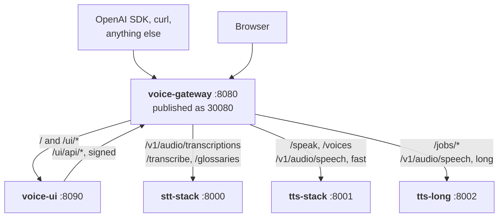
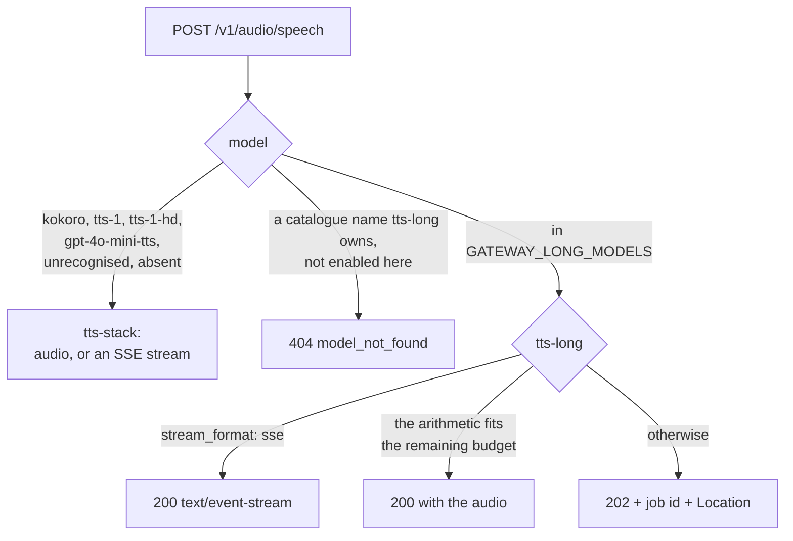
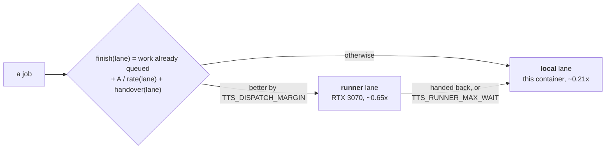
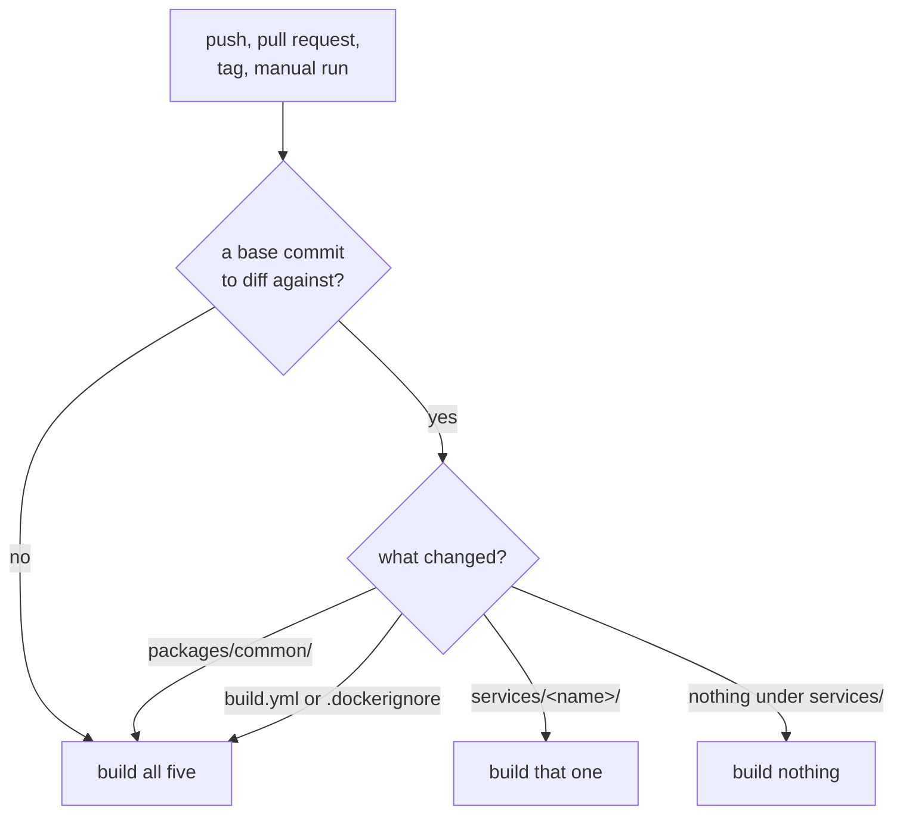

# Architecture and engineering notes

The [README](../README.md) is the short version: what Calliope does, how to start
it, and what the API looks like. This is the rest of it — the shape of the
system, the whole API surface, every measurement with the conditions it was
taken under, what CI and the deployment actually do, and the traps an operator
will hit.

Each service's README stays the reference for its own surface. This document is
what sits between them, plus the findings that are not any one service's.

---

## 1. The shape of the system

### Five processes, one door



The loop back from the page to the gateway is the point of it. `voice-ui` is a
client of the gateway, never of a backend: it holds no key list, compares no
token, and can answer nothing the gateway would not have answered. If an edit
ever gives that container a URL for `stt-stack`, `tts-stack` or `tts-long`, that
sentence stops being true.

The service names in `compose.yaml` are DNS names on the app-internal network,
not directory names, and they are deliberately not renamed to match the layout.
`stt-stack` is what `GATEWAY_STT_URL` resolves, in that file, in the gateway's
own image defaults and in what is already deployed; the named volumes and
container names are keyed on them too, so renaming would orphan the models
already on disk to rename a hostname nobody types.

### Why each process is its own image

| | Resident | Rate | torch | What keeps it separate |
|---|---|---|---|---|
| `stt` — Parakeet | 1.4 GB | see §4.2 | no | ONNX Runtime carries Parakeet and Silero; CTranslate2 carries Whisper |
| `tts` — Kokoro | ~0.33 GB | see §4.4 | no | ONNX Runtime again |
| `tts-long` — Chatterbox | 6.6 GB | 0.21× | yes, CPU wheel | Twenty times heavier and twenty times slower than Kokoro, so it loads lazily and unloads after 600 s idle. A model a thousandth its size must not queue behind that |
| `gateway` | `mem_limit: 512m` | — | no | The auth boundary and the only published port |
| `ui` | `mem_limit: 384m` | — | no | It spawns `yt-dlp` on a URL a browser chose |

The gateway and the page hold no model and no state, so the only figures worth
quoting for them are their limits. Nothing has measured their resident size.

Chatterbox has no ONNX build, so torch is unavoidable there. The **CPU wheel**
is deliberate: the CUDA wheels add several gigabytes, and the card this would
otherwise target is a GTX 1060, whose FP16 runs at 1/64 rate — and 6.5 GB does
not fit in 6 GB of VRAM at fp32 regardless.

### Where state lives

| Volume | Mounted by | Holds |
|---|---|---|
| `stt-models` | `stt-stack` at `/models` | The recogniser's weights |
| `stt-glossaries` | `stt-stack` at `/glossaries` | Custom vocabulary profiles |
| `tts-models` | `tts-stack` at `/models` | Kokoro's weights and voice tensors |
| `tts-long-models` | `tts-long` at `/models` | Chatterbox's weights |
| `tts-long-out` | `tts-long` at `/output` | Job audio, and one record per run |
| `voices` | `voice-ui` read-write, `tts-long` read-only | Reference clips for cloning |

Two things are not on that list. The gateway mounts only `/etc/certificates`
read-only and keeps nothing. And **`tts-long`'s queue is a dict in one process**,
so a restart empties it while the files sit in the volume and survive; the
`runs/{id}.json` record is the index and the audio is an attachment.

Audio and records expire on separate clocks. Audio goes after `TTS_AUDIO_TTL`
(a day) and the row stays, marked `audio.state: "expired"`; the record goes
after `TTS_RECORD_TTL` (a month). One TTL used to take both, so what was said,
which voice said it and which machine ran it — a few hundred bytes — was thrown
out with the megabytes every twenty-four hours, and the job list could only ever
show today.

`voices` has **exactly one writer**, `voice-ui`. `tts-long` mounts it read-only
and rescans when the directory's mtime changes, so a clip written through the
page, or copied in over SMB, is resolvable on the next request rather than after
a restart that costs a model load. One writer means no case where two processes
race on the same clip, and it means a compromise of the heaviest container in
the estate cannot plant a file the lightest one will serve.

### The shared package

`packages/common` is the wire contract: `auth`, `errors`, `health`, `models`,
`engines` (the shared catalogue), `runlog`,
`logging`, an `[audio]` extra, a `[conformance]` extra, and
`voice-entrypoint.sh` installed to `/usr/local/bin`.

It exists because `app/auth.py` existed in three repositories, once each, and
diffed pairwise at the point it was replaced:

| | Differing lines |
|---|---|
| stt-stack vs tts-stack | 197 |
| tts-stack vs tts-long | 187 |
| stt-stack vs tts-long | 170 |

They implemented the same idea, and **the drift was the defects**. One
adversarial review round found three different bugs, one set per copy:

- **A non-ASCII API key could never authenticate** (tts-stack). Starlette
  decodes header bytes as latin-1; the code compared UTF-8 bytes, so the
  *correct* key was rejected with a message saying it was wrong.
- **`GET /health/` returned 401 once keys were on** (tts-stack). The check runs
  before routing, so FastAPI's 307 never happens, and any probe written with the
  trailing slash went permanently unhealthy.
- **`TTS_API_KEYS=','` silently disabled authentication** (tts-stack and
  tts-long) and logged that the variable was unset.

Two of the three outlived their own discovery, because the fix round patched
only the copy the reviewer happened to be reading: `stt-stack/app/auth.py:115`
and `tts-long/app/auth.py:68` were both still encoding UTF-8, and
`tts-long/app/auth.py:103` was still matching `OPEN_PATHS` as an exact string,
on the day the shared package landed. The package is the union of every fix.

The same shape had already repeated one level up, in the error envelope.
OpenAI's schema requires four fields on every error — `type`, `message`, `param`
and `code`, the last two required-but-**nullable**, so present as JSON `null`
rather than absent — and `voice_common.errors` built three. It also registered
no handler for `StarletteHTTPException`, so a mistyped path under `/v1` returned
FastAPI's `{"detail": "Not Found"}`, which `openai-python` reads no message off
and reports as a bare "unknown error". Three services each vendored their own
fix, every docstring saying the code belonged upstream. The fourth,
`services/gateway`, had none of it — and it is the process an SDK client
actually talks to. All of it is upstream now, the copies are deleted, and
`voice_common.conformance` carries the assertion that would have caught it.

One consequence was a wire change, measured rather than predicted. The 401 this
package builds carries all four fields on *every* path, native routes included.
It did not before: `stt` and `tts` each completed the envelope with a middleware
that returned early on any non-`/v1` path, so their native 401 shipped three
keys and their `/v1` 401 shipped four. `POST /transcribe` and `POST /speak` with
a bad key now answer with `"param": null` present; status, `message`, `type` and
`code` are byte-identical.

`services/gateway/app/auth.py` is the one `app/auth.py` left in the tree, and
that is by design: a different environment variable, and a `/health` that fans
out to three backends rather than reporting on itself.

**What deliberately stays out** of the package: Kokoro's voice table, recogniser
loading, the Silero VAD, glossary repair, Chatterbox's job queue, per-wheel
workarounds, audio encoding beyond the PCM byte contract, the 16 kHz input
guard, the concrete request models, and every Containerfile. The full reasoning
per row is in [`packages/common/README.md`](../packages/common/README.md).
"Could plausibly be wanted by a second service" is how a shared package becomes
a junk drawer.

---

## 2. The API surface

### 2.1 How a request is routed

**The criterion is the `model` string and nothing else.**

| `model` | Backend |
|---|---|
| `kokoro`, `tts-1`, `tts-1-hd`, `gpt-4o-mini-tts` | `tts-stack` |
| absent, empty, or any unrecognised value | `tts-stack` |
| every name in `GATEWAY_LONG_MODELS` | `tts-long` |
| a catalogue name **`tts-long` owns** that this deployment has not enabled | **404**, naming `GATEWAY_LONG_MODELS` |
| a catalogue name another backend owns | that backend |

**Not input length.** Length is a proxy for a quality choice and the cost of
getting it wrong is not symmetric: a perfectly ordinary 400-character request
would have a ~17-second call escalated into a ten-minute job, with nothing in the
request that asked for it. There is no auto-escalation in either direction. Long
input on the fast path stays there, bounded by the read timeout rather than by
an invented cap the backend does not have.

**Not a header.** A header like `X-TTS-Backend` would work and would be
invisible in the surface that
matters: every OpenAI-shaped client has a `model` field in its settings and no
custom-header field. A routing key nobody can set is not a routing key.

**The asymmetry is deliberate.** An unrecognised name goes fast, because the two
wrong answers cost differently and a typo should land on the recoverable one.
But a name the shared catalogue says `tts-long` owns, that this deployment has
not enabled, is a 404 naming the variable — otherwise somebody types a retired
engine's name, falls off the end of `GATEWAY_LONG_MODELS`, and **gets Kokoro**:
a different engine, a different voice, no error anywhere. The filter is on
`EngineFacts.owned_by` rather than on catalogue membership, so that the day the
fast path's own `kokoro` gets a catalogue row it is not suddenly answered 404.

**What the gateway never does:** retry, cache, rate-limit, load-balance, trip a
circuit breaker, pre-flight a health check, or rewrite a body beyond reading
`model`. The budget that decides all of those: a 2-second dictation clip is
190–240 ms of recognition at the deployed rate, so a feature that adds 20 ms has
taken 10% of the interactive path. Each rejection has its own reason, and they
are in [`services/gateway/README.md`](../services/gateway/README.md) under *What
is not here*.

**Native routes mount flat and unprefixed, and nothing is rewritten.** That is
load-bearing. `tts-long` answers a long request with `Location: /jobs/{id}` and
a body field `audio_url: /jobs/{id}/audio`, both relative to its own root;
mounted here at the same paths they stay correct with zero rewriting. A prefixed
design would need a rule that rewrites a header *and* a JSON field, and that
rule rots the first time the backend adds a field.

Upload bodies stream straight through — an hour of wav is over 100 MB and
buffering it would double resident memory on a host already holding 6.5 GB of
Chatterbox. `POST /v1/audio/speech` is the one exception, because the gateway
has to read `model` out of it, and that body is text measured in kilobytes.
Responses stream in every case.

### 2.2 Every route

Everything not in these tables is a 404 in the OpenAI envelope with
`code: unknown_url`. There is no catch-all: `/docs`, `/redoc` and
`/openapi.json` are **not** proxied, because `stt-stack` deliberately puts its
own behind a key and a wildcard would quietly undo that.

**OpenAI-shaped**

| Route | Answered by | Notes |
|---|---|---|
| `POST /v1/audio/transcriptions` | `stt` | Streamed through. All nine input formats, any rate, mono or stereo |
| `POST /v1/audio/translations` | `stt` | Whisper only. A Parakeet deployment refuses it by name |
| `POST /v1/audio/speech` | `tts` or `tts-long`, by `model` | Buffered at the gateway only to read `model` |
| `POST /v1/chat/completions` | `stt`, or answered at the gateway | See below |
| `GET /v1/models` | the gateway | A static table, no backend call |
| `GET /v1/models/{id}` | the gateway | One row of that same table, so the two cannot disagree |

**Native**

| Route | Answered by | Notes |
|---|---|---|
| `POST /transcribe` | `stt` | **16 kHz only.** Any container libav reads; stereo is downmixed; another sample rate is rejected rather than resampled |
| `POST /speak` | `tts` | Segments with explicit `pause_after`, per-segment voice. Unknown fields are a 422 |
| `GET /voices` | `tts` | |
| `GET /glossaries` | `stt` | Name, source and term count per profile |
| `GET`, `PUT`, `DELETE /glossaries/{name}` | `stt` | `PUT` streams its body and carries the query string — `?force=true` is what lets a single-word left-hand side through |
| `POST /jobs`, `GET /jobs` | `tts-long` | 202 with an id; the listing is filterable |
| `GET /jobs/{id}` | `tts-long` | Carries `offsets` from the first segment onwards |
| `GET /jobs/{id}/audio` | `tts-long` | |
| `DELETE /jobs/{id}` | `tts-long` | Cancels a queued job, or discards a finished one and its file |
| `DELETE /jobs/{id}/audio` | `tts-long` | Discards the audio and keeps the record |

**The page**

| Route | Notes |
|---|---|
| `GET /`, `GET /ui` | `/` redirects to `/ui` |
| `GET /ui/config`, `GET /ui/health` | What the page is allowed to render, and what is up |
| `GET`, `POST /ui/clips`; `DELETE /ui/clips/{name}`; `POST /ui/clips/from-link` | The reference-clip store |
| `POST /ui/resolve`, `/ui/commit`, `/ui/abandon`; `GET /ui/progress` | Link ingestion through MeTube |
| `POST /ui/fetch`, `POST /ui/captions`; `GET /ui/media` | Transcribe an ingested file, take its subtitles instead, or play it back |
| `POST`, `GET`, `PUT`, `DELETE /ui/api/{rest}` | The page's own XHRs, forwarded verbatim; `voice-ui` strips the prefix and sends them back with its key attached |

**Unauthenticated**

`GET /health`, and `/health/` with the trailing slash, matched after stripping
it. That is the only exemption, and it is registered by the same call that
registers the route, so the two can never name different strings.

### 2.3 The chat route, and why it is not a chatbot

`POST /v1/chat/completions` exists because an aggregator probes it before it
will list a provider at all, and a 404 there fails the whole provider check — so
the stack becomes invisible to everything behind that aggregator, including the
routes that work.

It transcribes, and it never answers a question. Exactly two strings can reach a
caller in an assistant message, and neither is composed at request time: a
message carrying an `input_audio` part comes back as that clip's transcript,
and plain text comes back as a fixed sentence saying this is a speech gateway
and where the real routes are.

The failure it is built against is not a rude answer. It is a **silent
promotion**: a router or a summariser added later sees a plausible reply,
concludes this box runs a language model, and starts sending it real traffic —
every request of which comes back wrong with a 200 on it. There is not one
parameter of anything here that could answer a question, so the canned sentence
has to be unmistakable. `usage` is omitted rather than returned as zeroes,
because nothing in this process tokenises anything.

Three details worth knowing:

- **A chat body is capped at 16 MiB**, tighter than the 512 MB the transcription
routes get, because this one is buffered whole.
  It cannot be streamed — the clip arrives base64 inside a JSON object — and one
  was measured at **3.8× its own size resident** while it is read, linear from
  5 MB to 32 MB. The count is taken while reading rather than from
  `Content-Length`, because a chunked request declares no length at all. 16 MiB
  of base64 is about 12 MB of audio: six minutes of 16 kHz mono wav, or
  twenty-five of a 64 kbps mp3.
- **Base64 is read the way tools emit it.** `base64` wraps at 76 columns,
  `openssl base64` at 64, and a browser that built the part from a `FileReader`
  result sends a whole `data:audio/wav;base64,…` URI. The wrapping and the
  prefix are stripped; everything else is refused, because `b64decode` in its
  lenient mode does not reject a stray character — it deletes it and closes the
  gap, which turns four mangled characters into a clip three bytes short that
  gets transcribed with a 200 on it.
- **A conversation handed back is not an error.** The message `openai-python`
  appends carries `refusal: null`, a field this route puts in its own replies.
  That and `annotations` are read and ignored on any message, as `name` is. Only
  an `input_audio` part is ever acted on, wherever it appears, so a previous
  turn's assistant text is not an instruction here.

### 2.4 The 202, and the synchronous boundary



The boundary is arithmetic rather than a constant. A request blocks only when
`TTS_OPENAI_SYNC_TIMEOUT` is enough for **this host at the rate it is currently
achieving**, less what is already queued, less a model load if the model is not
resident. The rate is measured from finished jobs rather than assumed, because
the same code ran at 0.217× on the deployed instance and 0.138× on a loaded
laptop, and a fixed constant turned requests under the documented threshold into
202s with nothing to read that said why.

The gateway neither invents this nor re-implements it. Its only job is to not
break it, which is why the long read timeout (240 s) sits **above** `tts-long`'s
own `TTS_OPENAI_SYNC_TIMEOUT` (180 s): a gateway that timed out first would
return 504 for a job that is still running and will produce audio, and would
throw the job id away. A lie plus a leak.

The cost, honestly: `openai-python` does not raise on a 2xx, so it hands that
JSON to the caller as if it were audio and `stream_to_file` will write it into a
`.wav`. Two things blunt it — the deviation is reachable only through an opt-in
model name, so no unmodified client meets it by accident, and the `Content-Type`
is `application/json` rather than `audio/*`, so a client that checks can tell.

**Turbo is past realtime and it is still a job.** `chatterbox-turbo` measures
1.5426× realtime on the runner's card, comfortably past the point where a short
request could be answered down the socket. It stays a job permanently, because
that card belongs to somebody who is often using it: the same request is about
nine seconds when they are away and about four minutes when they are not. A
route that is *sometimes* fast is worse than one that is always a job id. See
[ADR 0008](adr/0008-two-engines-and-both-stay-jobs.md).

### 2.5 The SSE stream

Both TTS services stream for real, and the frames are OpenAI's: bare `data:`
lines carrying `{"type":"speech.audio.delta","audio":"<base64>"}`, then one
`speech.audio.done`. Comment lines (`: keepalive`) appear while the stream is
waiting and every SSE decoder ignores them.

On `tts-stack`, the schema's own 4096-character maximum, `bm_fable`, mp3, on an
M2 Max, median of three runs each way — 188.4 s of speech, 1 507 820 bytes:

```text
buffered   first byte at 58.98 s, complete at 58.98 s
streamed   first byte at  5.49 s, complete at 55.06 s   11 deltas
```

The first delta arrives 10% into the generation and the stream finishes no later
than the buffered response does. Concatenating the base64 of every delta
reproduces the buffered body byte for byte, because both formats come out of one
encoder drained two different ways — `wav` and `opus` are the two measured
exceptions and both are written down as deviations.

Before this, `stream_format` was **accepted and silently dropped**: HTTP 200,
`content-type: audio/mpeg`, no frames, no error. And because `openai-python`
casts the result to `HttpxBinaryResponseContent` for both stream formats and
never inspects the content type, an SDK-based test could not see it — the client
wrote the mp3 to disk and reported success.

Three framing decisions the schema does not settle, and four scars:

- **No `event:` name lines.** The schema models the JSON payload only and gives
  no `event` field, unlike `ErrorEvent` in the same file which models one
  explicitly. The only verbatim OpenAI audio SSE transcript in the spec uses
  bare `data:` lines.
- **No trailing `data: [DONE]`.** Nothing authoritative says OpenAI emits one
  here, and `speech.audio.done` is already terminal.
- **Every event ends in a blank line, the last one included.** Fed a stream
  whose final event ended in a single newline, `openai-python`'s `SSEDecoder`
  dropped that event silently — no error, no warning, and a client that never
  sees `speech.audio.done`.
- **`X-Accel-Buffering: no` goes out with the stream**, for a reverse proxy in
  front: nginx buffers a proxied response by default and would hold every delta
  until the last, undoing the feature without changing a byte of it.
- **A client that hangs up takes its encoder with it, now.** Starlette stops
  iterating a generator when the socket closes but never closes it, so the
  `GeneratorExit` that kills ffmpeg used to wait on the cyclic collector. An SSE
  request abandoned after its first delta still had a live ffmpeg **200 s
  later**, blocked on a stdin that would never close, on a stream that would
  have finished in 29 s. The response closes its own generator now, however it
  ends; the same request cleans up in 9.3 to 12.4 s, which is the chunk already
  inside the model finishing.
- **If a synthesis fails after the headers have gone out**, the stream carries
  an event with a top-level `error` key, which is the one in-band channel a 200
  has left. `openai-python` raises `APIError` on it and stops reading.

On `tts-long` the stream is incremental in the same sense but on a different
scale: the first delta leaves when the first *sentence* finishes generating,
measured at 0.42 s of a 1.66 s response on a four-chunk request, with an
assertion that fails if the first delta ever arrives in the last fifth of the
response. What streaming does not do there is make the service fast — 4096
characters is still around 400 s of speech and half an hour of CPU. It removes
the dead air and the client-side timeout. The realistic floor for first sound is
one sentence, so 3–8 s of audio and 15–40 s of compute.

### 2.6 The `/ui/api` seam

The page's XHRs come back to `voice-ui` rather than going straight to the
gateway, so there is one origin: no CORS on the gateway, no preflight on every
upload, and no second base URL to get wrong. `voice-ui` strips `/ui/api` and
forwards, adding `Authorization` from `config.gateway_authorization` — one
function, so the proxied routes, the key probe and the ingest hand-off cannot
drift apart. An inbound header is **replaced**, not joined: HTTP lets a field
name repeat, and two `Authorization` headers on the wire would let a caller
choose which key the gateway read.

That leaves a seam belonging to neither side, and it has already failed once.
**`PUT` was missing from the gateway's `/ui/api` passthrough** while both the
page's own allowlist and the gateway's `/glossaries` routes had it, so saving a
vocabulary profile died with a 405 `method_not_supported` between two services
that both supported the write. Nothing noticed until a profile was written
against the deployed stack. Whoever adds a method to the page's forwarding table
has to add it to `UI_PATHS` as well; a test named after the defect is what says
so now.

The same shape produced two earlier gaps, both recorded in the code: `DELETE
/jobs/{id}` was implemented in `tts-long` all along and unreachable from the
published port, and `/ui/media` 404ed playback for the same reason.

### 2.7 Where the deviations are written down

Nothing is accepted and dropped anywhere in this stack. A field is honoured, or
refused by name with a 400 in OpenAI's envelope saying which engine could do it.
The full deviation tables, each with the measurement that forces it, are per
service:

| | Its deviations cover |
|---|---|
| [`services/stt`](../services/stt/README.md) | `model` not choosing an engine, the four Parakeet refusals, no diarisation, the two synthesised segment fields, what word timings mean on each decoder, `usage` as the duration variant, `glossary` as an extension |
| [`services/tts`](../services/tts/README.md) | `instructions` accepted and named, an unknown custom voice id rejected rather than substituted, `speed` clamped and announced, the 510-phoneme window, how streamed `wav` and `opus` differ from the buffered file, an empty `input` |
| [`services/tts-long`](../services/tts-long/README.md) | The 202, the 400 for a catalogue model this box has not enabled, `speed` and `instructions` as 400s, the thirteen OpenAI voice names, `sse` accepted for every model, unknown fields as 400s |
| [`services/gateway`](../services/gateway/README.md) | The routing rule itself, the chat route, the forwarding contract |

One decision is estate-wide and written down so the three cannot drift: the
content type per format. `pcm` → `audio/pcm`, `opus` → `audio/ogg`, `mp3` →
`audio/mpeg`, `aac` → `audio/aac`. The schema names no per-format MIME.

The governing rule for the gateway is **if the backend produced an answer,
forward it unchanged** — status, body and all. All three backends emit the
OpenAI envelope under `/v1` with distinct `code` values, and re-wrapping would
destroy the code a client switches on. `stt-stack` answers a rejected body with
422 where the two TTS services answer 400; both pass through as-is, because
normalising that difference would make the gateway a second, lying source of
truth.

---

## 3. The API contract's own rule

[ADR 0001](adr/0001-openai-api-compatibility.md) is the one decision every other
API choice is downstream of: `/v1` is OpenAI's API, not an API that resembles
it, and anything this stack offers that OpenAI does not is an **extension** that
must travel by a channel the OpenAI client libraries already provide —
`extra_body`, `extra_query`, `extra_headers` — never by changing the meaning or
the shape of something the specification already defines.

The test it has to pass: *a client that knows nothing about our extensions must
behave exactly as it would against OpenAI.*

That is why `glossary` is a body field an SDK reaches with `extra_body` and not
a repurposed `prompt`; why the four `/glossaries` routes are native rather than
`/v1` (OpenAI has no concept of a glossary profile, so there is nothing to be
1:1 with and claiming `/v1/glossaries` would take specification territory that
does not exist — [ADR 0003](adr/0003-glossary-profile-api.md)); and why the 202
is documented as a deviation rather than dressed up as a 200.

---

## 4. Measurements, and the conditions they were taken under

### 4.1 The machines

| Name | What | What it produced |
|---|---|---|
| **orko** | The TrueNAS box this is deployed on. Xeon E5-2697 v4 | Every figure labelled "on this deployment" |
| **An M2 Max** | A laptop, CPU only | The bench figures, and the macOS client's |
| **spring** | A Windows desktop on the same LAN. Ryzen 7 5700X3D, RTX 3070 with 8 GB | The optional GPU runner's figures |

A realtime factor is a property of a machine, not of a model. Every figure below
names the machine it came from, and `GET /health` reports what the running
deployment has actually observed, with the sample count beside it.

### 4.2 The realtime factor this repository states three ways

This is the single most important number to get right, and it has three values
in the tree:

| Where | Figure | What it describes |
|---|---|---|
| `services/stt/README.md` | **47–63×** | The benchmark, `int8` |
| `services/stt/README.md`, *Performance* | **about 5×** | A 15-second clip on four modern cores, back in about 3 s |
| `gateway/app/main.py`, `gateway/README.md`, `ui/app/config.py` | **8.5–10.4×** | The deployed figure — and the one every timeout is built on |

A factor of twelve apart, and the consequence is concrete rather than
cosmetic. A 2h14m recording is about two minutes of compute at 47× and about
sixteen minutes at 8.5× — **946 s, which exceeds the gateway's own 900 s
`GATEWAY_STT_TIMEOUT`.** The honest dialog for that file says "this will not
finish in one request", and quoting the optimistic figure would have said "two
minutes" instead.

So the page seeds the conservative figure (`UI_STT_RTF`, 8.5), labels it an
estimate, keeps its own EMA in `localStorage` corrected by the `realtime_factor`
the native `/transcribe` route returns on every real transcription, and warns
whenever `duration / rtf` crosses `UI_STT_BUDGET`.

**The two regimes must never appear in one table.** Where Parakeet and Whisper
are compared, the comparison is expressed as a ratio — "roughly seventy times
the speed" — which holds in either regime and mixes neither.

Outstanding work, stated so it is not forgotten: somebody has to re-measure on
the deployment and correct the gateway's `timeout_help` in the same change.
Until then the page's estimate and the gateway's own 504 message are built on
the same unverified number, which is at least consistent, and both will need
changing together.

### 4.3 Transcription

Twenty-five conditions and five Brazilian Portuguese corpora on identical audio,
`int8`:

| | pt-BR WER | English WER | Resident | Disk |
|---|---|---|---|---|
| **Parakeet TDT 0.6B v3** | **0.144** | **0.121** | 1.4 GB | 461 MB |
| Whisper large-v3 | 0.250 | 0.131 | 2.9 GB | 2.9 GB |

Parakeet won 21 of the 25. It also degrades far better: band-limiting to 4 kHz,
which is what a cheap or distant microphone does, cost Whisper **+206% WER** on
CORAA and Parakeet **+41%**. Whisper runs at 0.5–0.9× realtime on the same CPU
that gives the Parakeet bench figure, leads on clean read speech, and is the
only engine here that translates, streams, or takes `language`.

**Whisper is not selectable per request.** One recogniser is loaded per
deployment, chosen by `STT_MODEL`, because Parakeet needs 1.4 GB resident and
Whisper 2.9 GB, holding both does not fit the memory this is deployed under, and
a cold load is minutes. `whisper-1` is accepted because refusing it would reject
every existing client to make a point about a name, and every `/v1` response
carries `x-stt-engine` naming what actually ran. Switching engines is a redeploy.

**Decode-time biasing**, `bench/boost_bench.py`: 145 clips and 942 s over CORAA,
FLEURS pt-BR, LibriSpeech clean and Earnings-22, Parakeet at `int8`. Pooled
relative WER against no boosting, 95% paired bootstrap over clips:

| The list you send | WER | Change | 95% CI |
|---|---|---|---|
| none | 0.1135 | — | — |
| the shipped `tech`+`dictation` profiles, on audio containing none of it | 0.1135 | **byte-identical** | zero false fires |
| 200 unrelated phrases, the ceiling exactly | 0.1140 | +0.4% | [−0.8, +1.7] |
| the words that **are** in the audio | 0.1077 | **−5.2%** | [−9.2, −1.3] |
| those same words, padded to 200 with another language's | 0.1077 | −5.2% | [−9.5, −1.4] |

Irrelevant vocabulary is inert *in this decoder*, because at
`STT_BOOST_START_WEIGHT = 0` a phrase has to be entered on acoustics and a word
that is not in the audio never is. That is **not** true of the post-decode repair
path, where an irrelevant glossary cost **+12% WER on Parakeet and +28% on
Whisper** — which is why `STT_GLOSSARY_DEFAULT` ships unset and why selecting
several profiles at once is discouraged. Select the one that matches what is
being said. The mechanism is [ADR 0005](adr/0005-parakeet-decode-time-biasing.md).

**Denoising was measured and is not in the pipeline**: +26% mean WER, worse in 9
of 13 conditions, one case above WER 1.0 from hallucination. The pipeline is
decode → VAD → ASR → glossary with no preprocessing stage anywhere, and the
page carries that as a note so nobody adds it back.

**The encoder has a cliff, and it is not a timeout.** Parakeet's Conformer
encoder computes self-attention over everything handed to it in one pass, which
is O(n²) in the length. Bisected against a deployed instance, one recording
looped to different lengths, 16 kHz mono wav:

| Speech | Result |
|---|---|
| 5.0 min | 200 in 45.2 s |
| 6.0 min | 200 in 61.5 s |
| 6.6 min | 200 in 71.2 s |
| 7.7 min | **500 in 7.6 s** |

The failure arrives *faster* than the successes, which is the tell: the encoder
gives up in its first layer, before any decoding starts. So the pipeline cuts
long input into passes of at most `STT_MAX_WINDOW_SECONDS` (300, counting
**speech** rather than audio, because the VAD runs first) and stitches the
results, landing cuts on pauses the VAD already found. 300 s is 0.65 of the
shortest length measured to fail on that host. Lower it on a smaller box — the
attention matrix is `(n/0.08)²` floats per head per layer, so the cliff moves
with whatever else is resident.

### 4.4 Speech, fast path

| Machine | Threads | Rate |
|---|---|---|
| M2 Max | — | **4.1×** and 4.3× (20.7 s of speech in 5.0 s; 17.1 s in 4.0 s) |
| orko | 4 | **1.83×** |
| orko | 8 | **2.79×** |

**Why live `/health` shows something else.** The published `realtime_factor` is
an EMA over whatever sizes have been asked for lately, and a short request
measures well below the marginal rate: this deployment answered a 1.2 s clip at
1.8× and a 22 s one at 2.4× within a minute of each other. At the time of
writing, live `/health` reports `realtime_factor: 0.73` over 46 samples. That is
a statement about the sizes requested, not about the machine, and anyone
comparing a documented figure against a live `/health` needs this paragraph.

Both fields are **absent until something has been synthesised**, which is the
useful part: a client deciding whether it can play audio as it arrives can tell
"not measured here yet" from a number, which a seeded average cannot say. The
first observation is taken whole and later ones move the figure by 0.3.

`TTS_RAMP_RATE` is a fixed 2.0 and is deliberately **not** read from that EMA. A
schedule that read it would switch itself on and off between requests, and the
ramp's own small first chunks would drag the figure down and then switch the
ramp off. 2.0 is the 2.4× measured at eight threads with a fifth held back; it
survives a machine a sixth slower with half a second to spare, and below about
1.85× no schedule survives and none is planned. The measured rate is still
consulted, but only as a guard.

**Chunk size against first-audio latency**, on a 4096-character input:

```text
TTS_CHUNK_PHONEMES   chunks   audio     first chunk
       509              7     154.5 s      6.21 s
       200             17     174.5 s      2.25 s
       100             39     180.8 s      1.29 s
```

The 17% growth is the duration predictor seeing less context per chunk, not
silence accumulating at the seams. It is a real change to the speech, which is
why the default does not move.

**The ramp**, on orko at eight threads, 494 characters, `pcm`:

```text
              first audio   file complete   duration
whole            8.00 s        8.00 s        22.68 s
ramped           1.41 s       11.27 s        28.67 s
```

5.6× sooner to a sound, and the price is on the same table: the file lands three
seconds later and the speech is 26% longer, because Kokoro speaks a short chunk
slowly — 0.064 s per phoneme at 52 phonemes, 0.055 at 120, 0.053 at 155, against
0.045 for the whole 495-phoneme utterance. The ramp pays that on the opening
seconds instead of on everything, and a long request pays proportionally less.

Chunk sizes follow the rule the page enforces at the other end: play a delta as
it lands, stop when the audio in hand falls below the time since the last delta
arrived. That gives `60, 60, 98, 157, 240, 358, 509`. A client that reads
`X-Chunk-Phonemes` can tell a late delta from an expected one, so it needs half
that margin — it asks with `X-Chunk-Plan: 1` and gets `60, 134, 281, 509`
instead. The careful schedule is the default because the service has to be safe
in front of a client that has never heard of either header.

### 4.5 Speech, long form

M2 Max, CPU, `exaggeration=0.3 cfg_weight=0.3 temperature=0.6`:

| Threads | rtf (en) | rtf (pt) | Peak RSS |
|---|---|---|---|
| 4 | 0.213× | 0.212× | 6.8 GB |
| 8 | 0.208× | 0.187× | 6.6 GB |
| 16 | 0.217× | **0.223×** | 6.5 GB |

Re-measured on the deployed instance on 2026-09-01, which is where the rest of
`tts-long`'s figures come from:

```text
65 characters, one string    ->   6.6 s of audio in  21.9 s   (0.303x)
1690 characters, one string  ->  40.0 s of audio in 184.6 s   (0.217x)
1690 characters, 20 segments -> 100.2 s of audio in 338.1 s   (0.296x)
```

Speech rate across those samples runs from 9.8 characters per second — one short
sentence, where the silence at each end dominates — to 19.3 on a 336-character
passage. Estimates use 12 and say so, and the chunk ceiling is checked against
the *slowest*, because that is the direction that truncates.

On the runner's card, `spring`:

| Configuration | rtf | vs baseline | VRAM |
|---|---|---|---|
| chatterbox fp32 | 0.6531× | 1.00 | 4199 MiB |
| **turbo fp32** | **1.5426×** | **2.36** | 3805 MiB |
| turbo fp16 | 1.5361× | 2.35 | 3393 MiB |
| bf16 | 0.6140× | 0.94 | 3259 MiB |
| fp16 | 0.6035× | 0.92 | 3259 MiB |

**Precision is a VRAM lever here, not a speed lever.** The cast genuinely
happens — weights fall from 3057 to 2035 MiB — and it is still slower, because
the model is autoregressive at batch one and bound by kernel-launch latency
rather than by matmul throughput. There is no precision setting in the service
and there is not going to be one.

### 4.6 The gateway hop

Measured on a laptop over loopback with a trivial JSON body, 300 requests:

```text
direct            0.32 ms median
through gateway   1.17 ms median
                  0.85 ms added
```

Under 1% of a 200 ms dictation turn. It has **not** been measured on the
deployment, whose CPU is slower and busier, and it will be larger there.

---

## 5. Findings that shaped the code

Each of these was built or tested, measured, and then acted on. They are here
rather than in a service README because each one closed a direction the project
was heading in.

**A second recogniser as a cross-check does not work.** Built, measured,
removed. Across every disagreement observed the second model was the wrong one;
not once did it catch a real error. A second opinion only informs when it is
roughly as good as the first — when it is reliably worse its dissent reduces to
"the weaker model is wrong again", at about 40% of throughput. It cost most
where it mattered least: on short clips, which is what dictation consists of,
fixed per-request cost dominates, and the rate ran 0.39–0.47 on spontaneous
corpora against 1.26–1.60 on read ones.

**LLM cleanup of a transcript is a trap at any size that fits on this box.**
Tested at 4B with an explicit prompt forbidding it, the cleanup stage still
inverted meaning ("makes no sense to be available to me" became "are not
available to me"), reversed pronouns ("those tasks for you" became "those tasks
for me"), deleted content it had been told twice to preserve, and leaked its own
reasoning into the output. Reliable adherence starts around 14B, which needs
10–20 GB of VRAM. Below that the raw transcript is more faithful than the
cleaned one, and a faithful transcript is the product.

**Chatterbox silently truncated everything over 40 seconds.** `generate()` stops
after 1000 speech tokens (chatterbox-tts 0.1.7, `chatterbox/mtl_tts.py:297`) and
S3 speech tokens run at 25 Hz
(`chatterbox/models/s3tokenizer/s3tokenizer.py:18`), so one call cannot produce
more than forty seconds of audio however much text it is given. 1690 characters
— about 170 seconds of speech — came back as **exactly 40.0 seconds**, with no
error and no warning, after paying for the whole thing in CPU. The same text
through the segment path, which was never truncated, produced 100.2 seconds.
Every input is chunked at sentence boundaries and spliced now, on `/jobs` and on
`/v1/audio/speech` alike; `chunks` in the job body says how many a request
became, and `TTS_CHUNK_MAX_CHARS` (280) is the hard ceiling that has to stay
under 40 s of speech at the slowest observed rate.

**Threads do not help Chatterbox.** From 4 to 16 the rate moved under 5% —
0.213× to 0.217× on English — because autoregressive token generation is
sequential and cores cannot parallelise it. That is why long-form speech is a
queue rather than a bigger box, why `tts-long` runs exactly one job at a time,
and why `TTS_LOCAL_RESIDENT_MAX` is 1.

**The pauses matter more than the voice.** Tested by ear on the same voice and
the same words, three ways: flowing prose, short declaratives, and short
declaratives with 0.75 s of inserted silence. Only the third sounds like
instructions, and nothing changed but the writing and the gaps. The silence is
generated in `services/tts` rather than asked of the model — no TTS model
reliably produces a beat you can act inside; punctuation buys a breath, an
instruction needs a gap. So the model is not the interesting variable: write for
the ear and place the pauses, and any competent voice will do. A voice is a
510 KB embedding over weights that are already resident, so alternating between
two costs nothing and a segment may name its own.

**The gateway earns nothing until the three backend ports are closed.**
Everything about a single auth boundary is a property of `compose.yaml`, not of
the code. Until that file applies, the gateway is a fourth container and an
extra hop in front of three ports still open to the LAN. Being precise about the
mechanism: container-to-container traffic on a shared compose network works with
or without `expose`, so **the enforcement is the absence of `ports`**, not the
presence of `expose`. `expose` is kept because it documents which port each
service listens on, and a reviewer reading that file for the boundary should see
a declaration rather than a blank.

---

## 6. Deployment

### 6.1 `compose.yaml` is a live deployment, not a template

Every backend setting in it was copied verbatim from the deployed app —
environment, `cpus`, `mem_limit`, volumes, tag, `pull_policy`, `restart` and
healthcheck, unchanged to the character — because that file is about the network
boundary and must not be able to alter anything else. The five lines that belong
to the original machine, and what to do with each, are in the README's *Run it*
table.

As written it asks for **31 CPUs and about 18.9 GB** across the five, which is
the box it came from rather than a requirement:

| | `cpus` | `mem_limit` |
|---|---|---|
| `voice-gateway` | 2 | 512m |
| `stt-stack` | 10 | 6g |
| `tts-stack` | 8 | 2g |
| `tts-long` | 10 | 10g |
| `voice-ui` | 1 | 384m |

Set the container's CPU limit **and** the service's `*_THREADS` to the same
number. ONNX Runtime sizes its thread pool from the host's core count, not the
cgroup, so a `--cpus` limit alone leaves the container spawning a thread per
host core and then contending for the slice it is allowed — slower than simply
using fewer threads.

### 6.2 TLS and the entrypoint

TLS is opt-in and never invented. Nothing generates a self-signed certificate: a
certificate that appears by magic is one every client is taught to stop
validating, and a client taught to skip verification keeps skipping it against
the real one. Every path out of a half-configuration is `exit 1` rather than a
quiet fallback to plain HTTP — one of the three original entrypoints warned and
served HTTP, one had no command check at all and appended `--ssl-certfile` to
whatever `CMD` it was given, and the shared script is the union of the strictest
rule from each.

On the deployment the certificate is the wildcard TrueNAS already manages for
the host, and the key stays `0400 root:root`. `voice-entrypoint.sh` copies the
pair into a private directory owned by uid 1000 on every start, while it is
still root, so a **renewed** certificate is picked up by a restart rather than
going stale in a copy somebody made by hand. Then it takes ownership of the
mounted volumes and drops to uid 1000 with `setpriv` before anything is served.

Two hops deliberately skip verification, and only two: the gateway's own
healthcheck, which dials `127.0.0.1` — no certificate for a hostname can match a
loopback address, and the check is "is this process answering", not "is the
certificate right" — and `voice-ui` → `voice-gateway`, whose target is a compose
service name on a bridge network that no public certificate can match. The
published port still presents the real certificate.

### 6.3 Healthchecks

**None of the five images carries a `HEALTHCHECK` instruction, and that is not
an oversight.** `HEALTHCHECK` is not a field in the OCI image spec, and CI
builds with buildah, whose default format is `oci`, so the instruction is
dropped silently on the way to the registry — `docker inspect` on a published
image shows none. The probes live in `compose.yaml`, which is where they take
effect, and that copy is the only one there is. Delete a probe from that file
and the container has no probe.

Two rules hold across all five:

- **Every healthcheck dials its own container's `127.0.0.1`.** None touches the
  gateway or a sibling. A container must never be restarted because a different
  container is down, and a probe aimed at the gateway would turn one backend's
  outage into all five restarting.
- **No `depends_on` anywhere.** `service_healthy` on `tts-long` would hold the
  gateway down for up to 900 s, which is exactly when somebody most wants
  `/health` to answer and the page to load. The gateway already returns a named
  503 with `Retry-After` for a backend that is not up yet, so starting first is
  the useful behaviour rather than a race to tolerate.

`start_period` per service, and why each is what it is:

| | `start_period` | |
|---|---|---|
| `voice-gateway` | 30s | No model to load |
| `voice-ui` | 30s | No model to load |
| `tts-stack` | 300s | ~340 MB on first start |
| `stt-stack` | 600s | 461 MB on first start |
| `tts-long` | 900s | ~3 GB, and only on the first job. A shorter grace kills the container mid-download and the next one starts the download again |

### 6.4 `/health`

It needs no key, it always answers **200** even when a backend is unreachable —
read `status`, not the status code — and it says a great deal:

- **Per backend:** its internal URL, whether it was reachable, its HTTP status,
  and its own body inlined rather than summarised. `model_loaded: false` on a
  cold `tts-long` and `status: "loading"` on a starting `stt-stack` are the
  answers to the question an operator is about to ask next.
- **From `stt`:** the loaded recogniser, whether it accepts a vocabulary,
  whether it translates, whether it streams, the glossary names, VAD state,
  threads, and the host label.
- **From `tts`:** voice count, default voice, threads, and the realtime factor
  with its sample count — both absent until something has been synthesised.
- **From `tts-long`:** `model_loaded`, queue depth and capacity, the realtime
  factor broken down by lane and by engine with the observation count for each,
  the full engine catalogue (languages, controls, minimum reference seconds,
  cold-load seconds, native sample rate) and, when a runner is configured, its
  state, mode, machine state, limits, CPU and memory.

It fans out on every call with **no cache** — three concurrent local requests, a
5 s timeout each. Something polling it once a second would triple that rate onto
the backends; nothing does today. The gateway's own healthcheck calls it, and it
must never answer 503, because a 503 caused by a cold `tts-long` would have the
orchestrator restart the one container that has to stay up to report the outage.

Do not publish 30080 to the internet.

### 6.5 The traps

**Setting `GATEWAY_API_KEYS` takes the page offline.** Reproduced against the
real app with two keys set: the startup line prints `authentication enabled,
2 key(s); unauthenticated: /health`, and then `GET /`, `/ui`, `/ui/health`,
`/ui/config`, `/ui/clips` and `/ui/api/v1/models` all answer 401 with
`WWW-Authenticate: Bearer`. Enforcement is middleware over the whole
application, so a route added later is protected by default and `/health` is its
only exemption. There is nowhere in a browser to present a key: Bearer raises no
browser prompt, and the page's key box was deliberately removed. `UI_GATEWAY_API_KEY`
signs the `voice-ui` → gateway hop, never the browser → gateway hop that is
refused first — and setting it makes **anyone who can open the page
authenticated by it**, which is why the page logs a WARNING at startup whenever
it is set. If `GATEWAY_API_KEYS` is set and that one is not, the key probe turns
the failure into a 503 `misconfigured_api_key` naming the variable rather than
passing "Incorrect API key provided" through to a page with nowhere to type one.
Until the gateway can mint a browser credential of its own, keys and the page
are mutually exclusive. If you only use the API and never the page, setting it
is safe and correct.

**Unset means open, for every service.** `GATEWAY_API_KEYS` ships unset, and the
gateway is the only process here that checks a token: `stt`, `tts` and
`tts-long` all run with authentication off behind it. It says so at WARNING on
every start. A degenerate value — empty, `,`, or `,,  ,` — exits at startup with
a sentence rather than being treated as off, because `-e GATEWAY_API_KEYS=$SECRET`
with `SECRET` unset is a real accident and here it opens three services at once.
The client's `Authorization` header is stripped before forwarding and is not
replaced: relaying a key to three services whose own key lists are unset
achieves nothing except copying the secret into three more log streams.

**MeTube has no authentication of any kind.** Its configuration has no `auth`,
`user`, `password` or `token` key; `/add`, `/start`, `/delete`, `/retry` and
`/history` are all open, and an unauthenticated `GET /history` from off-NAS
answers 200. Calliope's ingestion routes are a strictly narrower client of
something already open, so this does not widen the hole — but shipping a page
that makes MeTube load-bearing is the moment to close it, because after that an
abuse of its port is a Calliope outage. The fix is a deployment one: unpublish
that port or firewall it to the NAS, and point `UI_METUBE_URL` at a LAN IP.
Point it at a LAN IP rather than through a reverse proxy in any case — a
hostname would go out to the router and hairpin straight back, adding a proxy
and a TLS handshake as failure modes for a hop between two containers on the
same box.

**The SSRF backstop is the network, not the code.** There are three layers: a
stdlib pre-filter (http/https only, no userinfo, ports 80 and 443 only, then
`getaddrinfo` and a check of **every** address the name resolves to — loopback,
RFC 1918, ULA, link-local including `169.254.169.254`, CGNAT, multicast,
reserved, unspecified, and IPv4-mapped IPv6 of any of those; `localhost*`,
`*.local`, `*.internal` and `metadata.google.internal` refused by name before
resolution is attempted); MeTube's own `url_guard.validate_url`, which is better
than ours because it also installs a connect-time `getaddrinfo` hook inside the
download subprocess and so covers redirects and DNS rebinding during the
download; and only then the metadata probe. **Still open, stated rather than
hidden:** yt-dlp's extraction follows redirects, and neither guard covers a
redirect *during extraction* to an internal host. The impact is blind SSRF — the
probe's output is reduced to five scalars, nothing is written to disk, and no
response body ever reaches a caller. Write the egress rule for this container;
do not assume it. `UI_PROBE=0` removes the probe entirely, at the cost of a
title-only confirm card.

**Every declined link has already left a record in MeTube.** `POST /add` runs
before the probe, deliberately, so the two guards see the URL first. That makes
`/ui/abandon` the other half of `/ui/resolve` rather than a nicety, and it
**verifies**, because MeTube's `/delete` answers `{"status":"ok"}` when it has
deleted nothing at all. The same trap applies to `/start`: `ids` there are URLs,
not the short `id` field, and a wrong one returns `ok` and silently does
nothing.

**Ingested files accumulate and nothing removes them.** There is no shared
volume to delete through, and `DELETE_FILE_ON_TRASHCAN` is a global MeTube
setting that would make the user's own trashcan button delete their music. Prune
the ingest folder by mtime on a schedule; move to a second, dedicated MeTube
instance with its own dataset if ingest volume ever becomes real.

**The upload ceiling is the gateway's, not the recogniser's.** `services/stt/app/main.py` reads an
`UploadFile` whole with no `Content-Length` check, no cap and no streaming, so a
4 GB file is buffered into a container limited to 6 GB and the failure is an OOM
kill rather than a message. The page compensates twice over: it rejects on
`Content-Length` above `UI_MAX_UPLOAD_BYTES` (2 GiB) before a byte is forwarded,
and the browser extracts the audio first — `decodeAudioData` →
`OfflineAudioContext` at 16 kHz mono → a hand-written WAV header turns a 2 GB
MKV into about 15 MB before it crosses the network. Above roughly 500 MB the
file is uploaded raw with a warning, because `decodeAudioData` needs the whole
thing resident. **Anything posting to the transcription route without going
through the page gets none of that.**

**Two volumes are not optional even though nothing fails loudly without them.**
Without `stt-glossaries`, `/glossaries` does not exist in the container,
`writable` is false and every `PUT` and `DELETE` answers 503 — which is
deliberate, because the alternative is a profile landing in the container's
writable layer and dying on the next `pull_policy: always` restart. Without
`voices`, `tts-long`'s registry is `["default"]` only, all thirteen OpenAI voice
names alias to the built-in speaker, and every cloned voice dies at the next
restart.

**First start is slow, legitimately.** No model is baked into any image.
Parakeet is 461 MB, Kokoro about 340 MB, and Chatterbox pulls about 3 GB on the
first job rather than at boot. A quarter of an hour before the stack reports
healthy is normal; later starts are immediate.

### 6.6 The optional GPU runner

Off by default, and unset means local-only: with no `TTS_RUNNER_HOST` every job
runs on this CPU and the remote module is imported and never used.



Two lanes, each one job wide, chosen per job by arithmetic rather than walked in
order ([ADR 0007](adr/0007-two-lanes-not-three-rungs.md)). The runner prices each
of its services separately — a game takes the card and leaves twelve threads
idle; a compile takes every thread and leaves the card at five per cent — so
this side reads the per-service `available` field the runner already resolves
rather than reading a machine-wide flag and reasoning from a device name. A
runner that predates that split publishes no `available` at all, and a missing
field is treated as "fall back to the machine-wide flag" rather than as `false`,
because refusing a perfectly good older runner for ever is the worse failure.

The measured gain: Chatterbox at 0.56–0.72× on the card against 0.275× on eight
threads of this container. Worth having, and written down rather than rounded up
to the order of magnitude somebody might assume. Nothing is ever spoken twice,
and a job handed back or left waiting past `TTS_RUNNER_MAX_WAIT` is spoken here
instead.

### 6.7 Configuration worth knowing outside the service READMEs

The full tables are per service. These are the ones that explain behaviour
somebody will meet without going looking for it:

| Key | Default | What it actually governs |
|---|---|---|
| `TTS_OPENAI_SYNC_MAX_CHARS` | `300` | The ceiling on input answered synchronously. `0` always returns 202. This is the mechanism behind the 202 warning |
| `TTS_OPENAI_SYNC_TIMEOUT` | `180` | How long the service waits before giving up and returning 202 instead. The gateway's `GATEWAY_TTS_LONG_TIMEOUT` (240) must stay above it |
| `TTS_IDLE_TIMEOUT` | `600` | Seconds before the 6.5 GB model is unloaded |
| `TTS_MAX_QUEUE` | `32` | Depth past which both long routes answer 429 with `Retry-After` |
| `TTS_COLD_LOAD_SECONDS` | `60` | Charged against the synchronous budget when the model is not resident. Covers the ~3 GB first download as well as the load; the load alone timed 22.2 s |
| `TTS_CHARS_PER_SECOND` | `12` | Measured between 9.8 and 19.3. Affects estimates and chunk sizing only |
| `TTS_RAMP_RATE` | `2.0` | See §4.4. Deliberately below the measured 2.4×, and deliberately not read from the live EMA |
| `STT_MAX_WINDOW_SECONDS` | `300` | Seconds of **speech** per encoder pass. `0` restores the single pass that produced the 500 |
| `STT_GLOSSARY_DEFAULT` | unset | **Leave it unset.** Irrelevant terms are not inert in the repair path |
| `UI_STT_RTF` | `8.5` | The conservative seed; the page measures its own on top |
| `AIV_HOST_LABEL` | `platform.node()` | Stamped into every job record. Set it to a stable name — a container's default node name changes on every recreate, so the job list would show a new machine each time |

Per-engine keys are spelled `TTS_<ENGINE>_<FIELD>`, with the engine id uppercased
and hyphens turned into underscores. A per-engine key for a control that engine
does not have is **fatal at boot**, naming the key and the way out, and so is a
global key that reaches no enabled engine. No key spells `turbo` by hand
anywhere, which is what keeps a third engine a catalogue row rather than a
branch.

---

## 7. Build and CI

### 7.1 The build context is the repository root

For all five, because `packages/common` is a path dependency and has to be
inside the context. A context of `services/stt` does not contain it, and a build
from inside a service directory fails on the first `COPY`.

```bash
docker build -f services/stt/Containerfile -t calliope-stt .
```

Other properties of all five images: `python:3.13-slim-trixie` as the base,
except `tts-long`, which is 3.12 because `resemble-perth` imports
`pkg_resources`; every one drops to uid 1000 before it serves anything; no model
is baked in.

### 7.2 One workflow

[`.github/workflows/build.yml`](../.github/workflows/build.yml), triggered on a
push to `main`, on a `v*` tag, on a pull request, and manually. The five nested
workflows the imported repositories brought with them are gone, because GitHub
reads `.github` at the repository root and nowhere else.

It keeps the conventions those five established: **buildah**; **native
per-architecture runners** (`ubuntu-24.04` and `ubuntu-24.04-arm`) rather than
qemu, because every image has `apt` and `pip` steps and an emulated arm64 pip
install takes tens of minutes where a native runner takes two; and
**`STORAGE_DRIVER=vfs`**, because buildah's overlay driver leaves overlayfs
bookkeeping xattrs on directories a `COPY` merges into and vfs produces none.

### 7.3 The path filter



A monorepo without this rebuilds `tts-long` — torch, several gigabytes, on two
architectures — because somebody fixed a typo in the gateway's README.

The base differs by event, and the difference matters: `actions/checkout` hands
a pull request the **merge** commit, so `HEAD^1` is the tip of the base branch
and `HEAD^1..HEAD` is exactly what the PR proposes; a push is diffed against
`github.event.before`, which can be any number of commits back and is not
reachable from a shallow clone, which is why the checkout is `fetch-depth: 0`. A
missing base is not fatal — the filter falls back to building everything — but
it would make the filter useless exactly when a branch is busiest.

A change under `packages/common/` builds all five because all five install it as
a path dependency, so its code is inside every image. That rule was written
while the gateway installed none of it and was rebuilt anyway, on the grounds
that "this service is exempt from the shared package" is exactly the kind of
fact that is true until it quietly is not. It stopped being true.

### 7.4 The runtime import checks

Each image gets a per-architecture check that its runtime can actually import,
because these packages ship per-architecture wheels and a missing arm64 wheel
builds fine and fails on the first request. They are not ceremony — each records
a defect that really happened:

- **torch would not import on arm64.** The amd64 wheels vendor their own
  `libgomp.so.1` and the arm64 ones do not, so the image built cleanly on both
  and failed at run time on one. `libgomp1` is in the `tts-long` Containerfile
  because of this check.
- **A stale `soundfile` assertion failed both `tts` builds** with
  `ModuleNotFoundError` for a module the image is correct not to have, after
  every encoder moved to feeding ffmpeg on a pipe and `libsndfile` left with the
  dependency.
- **`ffmpeg` is checked as a binary**, not just as a wheel, because the encoders
  shell out to it and `response_format` defaults to mp3 — a missing binary is a
  500 on the default request shape.
- **`yt-dlp` is checked as a binary on PATH** for the same reason: the page
  spawns it, and an install that shipped the package without its console script
  would build cleanly and degrade every confirm card to a title.
- **The page itself is checked into the image.** It is `COPY`d rather than
  built, so the one way it disappears is a Containerfile that forgot
  `app/static`.
- **`voice-entrypoint.sh` is checked onto PATH** for every image but the gateway
  and the page, which ship their own. A build that installed the package but not
  its `script-files` produces an image that starts and immediately exits with
  `exec: voice-entrypoint.sh: not found` — a run-time failure this makes a
  build-time one.

### 7.5 Tags

A per-architecture tag is pushed by each build job, then one manifest job
assembles them:

| Ref | Publishes |
|---|---|
| `main` | `:latest` and `:main-<sha>` |
| a `v*` tag | `:<version>` and `:latest` |

**Deploy from the version.** A moving tag meant a redeploy for an unrelated
reason silently swapped the running build — measured on this deployment, where
the images tagged for prerelease were four weeks stale while the version tag
carried every fix, and `pull_policy: always` made a redeploy swap the running
build in either direction. `compose.yaml` names a version on all five images, so
`git checkout <version>` gives you the stack that is running. Raising it is a
deliberate edit, which is the point.

Pull requests build and check but do not log in or push.

### 7.6 The package's own job

`packages/common` is not an image, so what CI proves about it is that it
installs and that its own tests — including the conformance suite it ships —
pass on **both** interpreters its consumers run: 3.12 for `tts-long` and 3.13
for the others. It installs against the same FastAPI version the services pin,
so a version skew shows up there rather than in a consumer's build. Then it does
a plain path install and asserts `voice-entrypoint.sh` is executable on the
scripts path, because setuptools installs it through `script-files` and a build
that stopped doing so would produce images that build cleanly and cannot start.

---

## 8. Tests

### 8.1 Install from the root, test from the service

```bash
pip install -r services/stt/requirements.txt './packages/common[conformance]'
cd services/stt && python -m pytest tests -q
```

Both halves are load-bearing, and getting either wrong produces an error that
reads like something else.

- **Install from the root**, because `requirements.txt` names
  `./packages/common` and pip resolves a path requirement against the
  **process's working directory** rather than against the file it read it from.
  From `services/stt` the same command fails with `Expected package name at the
  start of dependency specifier`, which reads like a syntax error in the
  requirements file and is not one.
- **Test from the service directory**, because every suite does `import
  app.main`, which resolves only when that service's own directory is pytest's
  rootdir. There is deliberately **no pytest configuration at the repository
  root**: running pytest there would put five different `app` packages in scope
  at once.

To edit `packages/common` and see it in a service without reinstalling, put an
editable install over the top:

```bash
pip install -e './packages/common[audio,conformance]'
```

### 8.2 The conformance suite

The three model services run the whole suite the shared package ships, against
the app object each actually builds. That is what makes one tree safe to share:
a bad change to `packages/common` fails at a consumer's test job rather than on
the host.

The gateway and the page run **one assertion** out of it rather than the whole
suite. Each is a router assertable in milliseconds against mock backends; each
publishes no `/openapi.json`; the gateway carries its own auth module and the
page has none, so most of the rest does not describe either. The one they run is
`assert_four_field_envelope` — the check the gateway used to fail.

### 8.3 What each suite is

Counted at `15f4667`, one commit past `v0.1.1`, run locally:

| Suite | Tests | Shape |
|---|---|---|
| `services/stt` | 163 | Conformance plus its own. No model is downloaded — the suite never runs the app's lifespan, and a parity suite asserts the whole compatible surface against a recogniser that is not a model |
| `services/tts` | 97 | Needs `ffmpeg` on PATH |
| `services/tts-long` | 328, 2 deselected | One test needs a real socket: it measures time to first byte, and `TestClient` runs the application to completion before it answers |
| `services/gateway` | 165, of which 8 are the live smoke test | Mock backends wired in through httpx's own transport layer, so every test runs the real proxy code — header filtering, streaming, timeout mapping, auth — with only the socket replaced. The deselected 8 are the live smoke test |
| `services/ui` | 505 | TestClient over an httpx `MockTransport`. **Nothing starts a server and nothing may**, and `yt-dlp` is never spawned |
| `docs/tests` | 64 | `compose.yaml` against the code, and the prose against the deployment |

The live smoke test against the running stack **skips itself** when the host is
unreachable, which from a CI runner it should be, and is deselected by name
anyway: a CI job must not depend on somebody's NAS being awake, and must not
queue work on it. It queues no long-form work even when it does run, because
`tts-long` runs one job at a time on a 6.5 GB model, so that path is exercised
read-only.

**On `ffmpeg`:** the `tts` job once ran without it. That is not a cosmetic gap —
`response_format` defaults to mp3 and every format but `wav` and `pcm` is
encoded by feeding ffmpeg on a pipe, so the default request shape could not be
answered. `Popen` raised `FileNotFoundError`, the route returned 500, and three
tests about headers and validation failed on it. It also gutted the run in
silence: the encoding tests are marked `needs_ffmpeg` and skipped themselves,
**17 skipped against 1 failure**, so the suite reported success over a third of
itself never having run.

### 8.4 `docs/tests`

Two shipped failures are what this directory is for.

The first: `compose.yaml` documented two runner keys as live knobs and
recommended an order naming a lane the code did not have, so **an operator
following this repository's own advice configured a lane that silently did no
work.**

The second is the shape it mostly guards: two halves of one feature, one of them
silent. A `model` string the gateway routes and `tts-long` has not enabled; an
engine advertised on the API that only a runner can render; a per-engine knob
for a control the engine does not have. Every one of those is audible in a test
and inaudible in production until somebody reads a waveform. So
`GATEWAY_LONG_MODELS` and `TTS_ENGINES` are asserted to agree, minus the
`tts-long` alias — adding an engine to one and not the other either advertises a
name that 400s or hides an engine the box can run.

It also checks the prose. `services/tts-long/README.md` said in two places that
there was one model and that refusing `model` "would be theatre", and every
sentence those two justified stopped being true the day a second engine was
reachable over the API. An engine on the API and absent from the README is an
undocumented API, and it is how somebody finds out about `chatterbox-turbo` by
reading a 400.

---

## 9. The macOS client

`clients/macos-player` is a client of the same contract `services/tts` speaks,
not a second implementation of it. Nothing here is built by CI or shipped as an
image — the capsule is `NSGlassEffectView` and no hosted runner has the macOS 26
SDK — so the machine that uses it is the machine that builds it.

### 9.1 Why it is an application

Without a bundle identifier, `SMAppService.mainApp` reports `notFound`,
`register()` throws, and **Open at Login is a control that does nothing**. There
is also no identity for macOS to grant Accessibility to and nothing for
Gatekeeper to check — which is what shipping it anywhere other than the machine
that built it requires.

### 9.2 Code inside, state outside

Code lives in `/Applications/Calliope.app`: the daemon in `MacOS/`, the player
as a nested helper app, and the local server as a resource. Everything that
changes lives outside it in `~/.local/share/calliope` — the Python 3.12 venv,
the ONNX model, the voice tensors, the logs, the queue. A signed bundle must not
be written to, and a re-install must not download 310 MB again.
`shared/paths.swift` is the one place that says which is which, compiled into
all three binaries.

### 9.3 The deployment target is pinned, and has to be

`arm64-apple-macos26.0`. Without `-target`, `swiftc` stamps the binary with a
minimum inferred from the build host — measured as `minos 28.0` on macOS 27 —
and LaunchServices then refuses to open the app at all, `-10825`,
`kLSIncompatibleSystemVersionErr`. Running the binary directly bypasses
LaunchServices and works, so this is invisible until somebody double-clicks it.

### 9.4 The hotkey

Carbon's `RegisterEventHotKey`, in 2026, on purpose: it is the only API that
gives a true system-wide hotkey without the Accessibility permission an
`NSEvent` monitor needs. **Accessibility is still required** — to read another
application's selection.

### 9.5 The local server

`server/server.py` on `127.0.0.1:47815`, speaking the subset of `services/tts`
the player uses: OpenAI's body with `response_format: "pcm"`, playing headerless
24 kHz 16-bit mono. It starts on demand and exits after fifteen minutes idle.

It returns one thing the stack has no equivalent of: **`X-Word-Timings`**, one
`[start, end]` per whitespace-separated word of `input`, built from the duration
output of the ONNX model — phoneme timings grouped at spaces, with each word
phonemised on its own where numbers or abbreviations expand ("42" is two spoken
words). That header is what the reader's underline follows. Without a usable one
the player estimates from word lengths instead. Position comes from the player
node's sample time, which counts source frames, so the highlight stays aligned
at any speed.

Measured on an M2 Max: the full model runs at about **4.9× realtime** on the
CPU. The `int8` model was 3× slower and ONNX Runtime's CoreML provider no
faster, so neither is used. First sound is about 0.3 s for a short sentence with
the server warm and about 4 s when the server has to start; sentences over 140
characters are split at clause punctuation so a long first one does not hold up
the start. Speed is applied while playing rather than sent to the model, so it
changes instantly without re-synthesising.

**Accents.** Text is normalised to NFC in the player and again in the server,
because selections can arrive decomposed (`e` + U+0301) and espeak drops a lone
combining mark — `avó` is then read as `avô`, `é` as `e`, and `não` loses its
nasal vowel. `services/tts` does not normalise.

**Temp directories.** `phonemizer` copies `libespeak-ng.dylib` into a new temp
directory per process and removes it only on a normal exit, so the server turns
SIGTERM into one.

### 9.6 A Calliope server is opt-in

Off is the resting state, and off is the whole of the privacy story: with
nothing configured there is no URL, no key and no network, because the model
runs faster than realtime on this CPU and a server would buy nothing.

Given an address, `server.py` becomes a proxy: the local names are answered on
the Mac as before and anything else is forwarded, with `GET /v1/models` listing
both and `owned_by` saying which side each comes from — so one address covers
every engine and nothing talking to `127.0.0.1:47815` needs to know where a
voice actually ran. Three details are deliberate:

- **The key is in the Keychain**, not in the preferences plist, which rides in
  every backup. The daemon is the only process holding both halves and passes
  them to the server in its environment, so a server started by the one-shot
  player has no remote at all.
- **The certificate is verified** whenever the address has a name in it. A bare
  IP cannot be verified by any certificate, so that one case is trusted on the
  strength of being your own network.
- **An unknown model is refused locally**, with both lists in the error, rather
  than forwarded — because a gateway answers a name it does not know with a
  default voice, which turns a typo into audio nobody chose.

### 9.7 Building and shipping it

`install.sh` builds from source and installs all four pieces; `release.sh`
builds the tarball the cask installs. Signing is ad-hoc by default, which is
enough to run on the machine that built it and not enough to run anywhere else —
a Gatekeeper-clean download needs a Developer ID identity and notarisation.

The OpenClip pairing is optional. It puts a **Speak** action on the selection
itself, which is useful where the hotkey is taken and is the only route in
applications that will not give up their selection to the Accessibility API. The
hotkey, the menu bar item and the command all work without it, and `install.sh`
skips the extension if OpenClip is absent.

---

## 10. Decision records

`docs/adr/` holds the decisions, dated, each with what it cost. The sequence
runs 0001–0010, 0012 and 0013; there is no 0011.

| | Status |
|---|---|
| [0001 — The API is OpenAI's, and extensions use OpenAI's own mechanisms](adr/0001-openai-api-compatibility.md) | accepted |
| [0002 — Glossaries are named profiles, chosen per request, and none ships personal terms](adr/0002-glossary-profiles.md) | accepted |
| [0003 — Profiles are managed over the API, and writability follows the volume](adr/0003-glossary-profile-api.md) | accepted |
| [0004 — Two long-lived branches](adr/0004-branching.md) | superseded by 0012 |
| [0005 — Parakeet is biased at decode time, and it is off unless a request asks](adr/0005-parakeet-decode-time-biasing.md) | accepted |
| [0006 — Long-form speech is routed between three machines](adr/0006-three-way-speech-routing.md) | superseded by 0007 |
| [0007 — Long-form speech has two lanes, and the runner's processor is deleted rather than left switched off](adr/0007-two-lanes-not-three-rungs.md) | accepted |
| [0008 — Two engines on the `model` string, and both of them stay jobs](adr/0008-two-engines-and-both-stay-jobs.md) | accepted |
| [0009 — A third engine, and the first one this container cannot run](adr/0009-a-third-engine-that-cannot-run-here.md) | superseded by 0010 |
| [0010 — The third engine was measured on the card it was for, and retired](adr/0010-the-third-engine-was-measured-and-retired.md) | accepted |
| [0012 — One branch: `main` is the branch, a `v*` tag is a release](adr/0012-one-branch.md) | accepted |
| [0013 — Nodes come in through the one door, and their socket is not behind a key](adr/0013-nodes-one-door.md) | accepted |

0009 is kept rather than deleted because every engineering fact in it is still
true; what it got wrong is its own first sentence, that this deployment offers a
third engine. 0004 is kept because its reasoning is still the reasoning.

---

## 11. Errata

Contradictions live in the tree today. Where a reader meets one, this is which
side is right.

| Where | What it says | What is true |
|---|---|---|
| `services/ui/README.md`, header block and *The short version* | The page is at `:30081`, and `:30081` is the trust boundary | There is no 30081. It was closed when the page moved behind the gateway; the boundary is 30080. Correct both the next time that file is touched |
| `services/stt`, `tts`, `tts-long`, `gateway` READMEs, *Status* | Work happens on `prerelease`, which publishes `:pre` | ADR 0012 deleted the branch and the workflow publishes no `:pre` tag. `main` is the branch, a `v*` tag is a release |
| `services/gateway/README.md` | "Not deployed yet" | It is deployed. `/health` answers on the published port |
| `services/gateway/README.md` | 63 tests | 157 at this commit |
| `services/stt/README.md`, *Glossary profiles* | "+28% on Whisper and 28% on Whisper" | A typo. `services/ui/README.md` has the pair: **+12% on Parakeet, +28% on Whisper** |
| `services/stt/README.md` headline vs `gateway/app/main.py` | 47–63× vs 8.5–10.4× | Different machines. See §4.2, and re-measure before quoting either as "the" rate |

---

## 12. Licence

BSD 2-Clause throughout. Each service and `packages/common` keep their own
`LICENSE`; upstream terms are in
[`THIRD-PARTY-NOTICES.md`](../THIRD-PARTY-NOTICES.md).